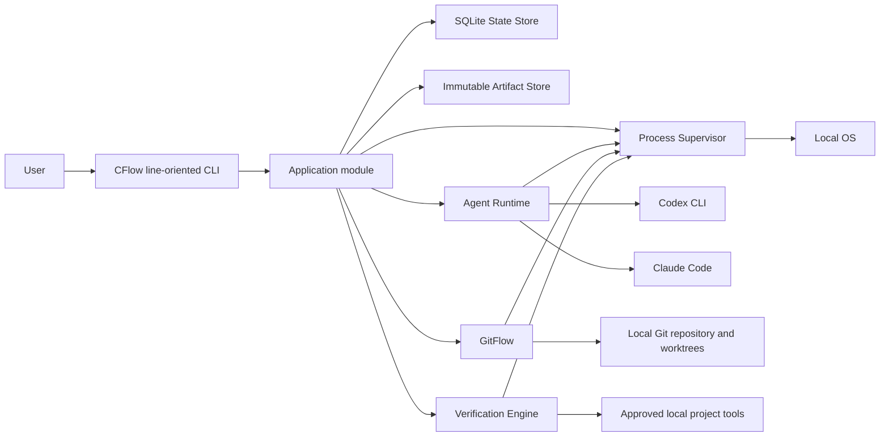
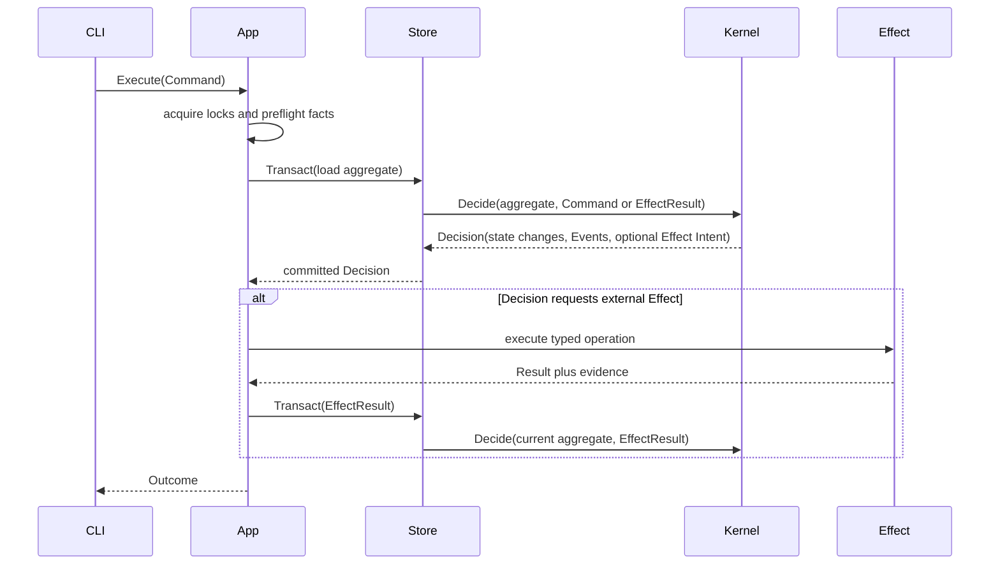

# CFlow Demo Technical Design

## 1. Document status and authority

This document translates the approved [CFlow PRD](./cflow-prd.md) into a Go architecture and executable technical contract. It does not change product scope, add a third normal approval gate, or authorize implementation.

The PRD remains authoritative for product behaviour. The user approved this design on 2026-08-02. If the two documents conflict, the PRD wins and this design must be corrected through an explicit successor revision.

The repository-wide domain language is defined in [`CONTEXT.md`](../CONTEXT.md). Code, schemas, CLI text, tests, and future documentation must use those canonical terms.

## 2. Design outcome

CFlow will be a foreground, local-first Go CLI built around one application seam and a small set of deep modules:

1. The CLI sends typed Commands or Queries to the Application module.
2. The Application module acquires locks, collects facts, invokes a pure Decision Kernel, commits authoritative database changes and Events, and executes typed external Effects.
3. The Decision Kernel is the only implementation allowed to decide Workflow, Node, Attempt, Session, Run, Approval, and Finding transitions.
4. SQLite owns mutable runtime state and the authoritative Event sequence. Immutable Artifacts, Git facts, OS process facts, and verification evidence remain separate fact sources.
5. Provider, Git, Verification, and platform behaviour live behind real seams because each has both production and deterministic test Adapters.
6. No module accepts arbitrary executable code. External execution is either an embedded, typed Runtime operation or an approved Verification Catalog entry expressed as executable plus argv.

The design deliberately avoids:

- one Repository per SQLite table;
- one thin Service per CLI command;
- a generic plugin framework;
- a generic event-sourcing framework;
- a generic workflow scripting language;
- direct table writes from CLI, Agent Adapter, Scheduler, or Git code;
- a second background daemon or cloud control plane.

## 3. System context



All CFlow-owned state remains local. Provider CLIs and approved project commands may use the network according to their own configuration; CFlow does not claim an offline or OS-sandbox boundary.

## 4. Package architecture

The initial package layout is:

```text
cflow/
├── cmd/cflow/                    # process entry point only
├── internal/
│   ├── cli/                      # Cobra commands and line UI
│   ├── app/                      # Application seam and orchestration
│   ├── config/                   # strict local configuration resolution
│   ├── model/                    # domain types and invariants
│   ├── decision/                 # pure state, failure and approval decisions
│   ├── compile/                  # Spec and Dynamic Workflow compiler
│   ├── schedule/                 # pure DAG readiness and dispatch policy
│   ├── store/                    # SQLite aggregate store and migrations
│   ├── artifact/                 # immutable Artifact Store and compatibility
│   ├── agent/                    # Agent interface, registry and Adapters
│   ├── gitflow/                  # typed Git facts and mutations
│   ├── verify/                   # Verification Catalog and evidence engine
│   ├── process/                  # argv process supervision and cancellation
│   ├── security/                 # path, permission and redaction policy
│   ├── observe/                  # logs, final report and audit export
│   └── platform/                 # OS locks, process identity and signals
├── migrations/                  # embedded forward-only SQLite migrations
├── prompts/                     # embedded versioned prompt templates
├── schemas/                     # embedded Artifact and IR schemas
└── tests/
    ├── integration/
    ├── e2e/
    ├── dogfood/
    └── testdata/
```

Dependency direction is one-way:

```text
cmd → cli → app
app → config, model, decision, compile, schedule
app → store, artifact, agent, gitflow, verify, observe
agent, gitflow, verify → process, security
store, artifact, process → security, platform
all packages → model only where domain types are required
```

Forbidden dependencies:

- `model`, `decision`, `compile`, and `schedule` must not import I/O packages from CFlow.
- Infrastructure packages must not import `cli` or call the Application module.
- Agent Adapters must not call the Store, mutate Workflow state, or execute Git policy decisions.
- GitFlow and Verification must not decide Node success; they only return facts and evidence.
- The CLI must not import Store internals or run external commands directly.

## 5. Deep modules and seams

| Module | Interface exposed to callers | Hidden implementation responsibility | Test surface |
|---|---|---|---|
| Application | `Query` and `Execute` | command routing, lock scope, transaction/effect loop, recovery-before-mutation, outcome rendering data | production and fixture commands through the same interface |
| Config Resolver | `Load` and `Resolve` | strict schema, precedence, safe defaults, normalization, conversion into immutable approval inputs | table tests over files, CLI overrides and environment |
| Decision Kernel | `Decide` | legal transitions, approval comparison, failure classification, retry charge, dispatch gating, required Events and Effects | pure table and property tests |
| Workflow Compiler | `Compile` | deterministic skeleton, Patch validation, Schema/DAG/coverage/budget checks, canonical output | golden and mutation tests |
| State Store | `View`, `Transact` | SQLite schema, aggregate hydration, optimistic checks, Event sequence, invariants, busy handling | real temporary SQLite databases |
| Artifact Store | `Put`, `Get`, `Resolve` | compatibility registry, canonical hash, atomic 0600 write, immutable revision paths | real temporary filesystem plus fault injection |
| Agent Runtime | `Detect`, `Start`, `Resume`, `Cancel`, `Inspect` | Provider protocol binding, JSONL framing, Session identity, event validation, redaction, process lifecycle | Fake, Codex and Claude Adapters |
| GitFlow | `Observe`, `Execute` | canonical repository facts, worktree registry, fingerprints, commit evidence, append-only refs, merge/apply safety | real temporary Git repositories and fault-injected process Adapter |
| Verification Engine | `ValidateCatalog`, `Run` | command identity, purpose, cwd/env policy, output limits, Git before/after facts, evidence manifest | Fake command Adapter and real fixture tools |
| Process Supervisor | `Start`, `Signal`, `Wait`, `Inspect` | argv-only launch, pipes, process groups, start tokens, bounded output, two-phase stop | OS Adapter and deterministic Fake Process Adapter |
| Recovery Engine | `Reconcile` | fact collection order, orphan detection, Intent/Result coordination, repairable vs blocking reconciliation | crash-point fixture matrix |
| Security Guard | `CheckHome`, `CheckPath`, `Redact` | owner/mode/symlink validation, path containment, streaming redaction, atomic sensitive writes | filesystem and redaction corpus tests |

The Process Supervisor seam is real: production uses an OS Process Adapter while tests use a deterministic Fake Process Adapter. Platform-specific process-group, signal, and identity mechanics remain private to those implementations.

The State Store is not split into public `WorkflowRepository`, `TaskRepository`, or `EventRepository` interfaces. Those would expose table structure and push transaction ordering into callers. The Store instead reads and writes domain aggregates in one transaction.

The Application module's interface is intentionally small, but it is a concrete Go type because the Demo has one implementation:

```go
type Application struct { /* private dependencies and implementation */ }

func (a *Application) Query(context.Context, Query) (View, error)
func (a *Application) Execute(context.Context, Command) (Outcome, error)
```

`Query` and `Command` are closed domain unions. There is no stringly typed command registry and no extension hook in the Demo.

## 6. Application execution model

### 6.1 Command categories

Commands are classified before execution:

| Category | Examples | Locks | May execute Effects |
|---|---|---|---:|
| Global read | help, doctor | shared DB Schema Lock when DB is read | no |
| Project read | list, status, inspect, logs | shared DB Schema Lock | no |
| Workflow mutation | create, resume, retry, pause, cancel | shared Schema + Project Writer + Workflow Owner | yes |
| Apply mutation | apply | shared Schema + Project Writer + Workflow Owner + Apply Lock | yes |
| Cleanup mutation | cleanup execute | shared Schema + Project Writer + Workflow Owner | yes |
| Migration | automatic before a stateful write | exclusive DB Schema Lock only | database migration only |

Read Commands never perform schema migration. If their current binary has no safe Reader for the detected schema, only help and doctor remain available.

`pause` and `cancel` have a restricted safety-command path: after acquiring the applicable OS locks, they may stop and reconcile already managed processes even when Provider compatibility, local permission posture, or Project Quarantine blocks normal mutation. They may not start a Provider, allocate a Retry, generate an Artifact, Merge, or Apply. If the database schema itself cannot be interpreted safely, only doctor/help are available because CFlow cannot persist a trustworthy stop result.

### 6.2 Decision/effect loop

Every mutation follows the same protocol:



Rules:

1. A Decision is pure data. It cannot access the clock, filesystem, Git, Provider, or database.
2. An external Effect is not executed until its Intent and expected facts commit.
3. Effect Results are immutable evidence inputs to another Decision.
4. Only the Store applies a Decision, and it applies state changes plus authoritative Events atomically.
5. An Effect executor cannot mark a Node, Attempt, Run, or Workflow successful.
6. All externally meaningful IDs, timestamps, hashes, and expected HEAD values are fixed before the Effect when possible.

### 6.3 Typed Effects

The closed Effect union includes only Runtime-owned operations:

```text
ArtifactWrite
ProviderStart | ProviderResume | ProviderCancel
PlanningWorktreeCreate
IntegrationWorktreeCreate
TaskWorktreeCreate
GitCommitInspect | GitAuditRefCreate
IntegrationMerge | IntegrationRollback
VerificationRun
ApplyStagingCreate | ApplyFastForward
ManagedProcessStop
CleanupWorktreeRemove | CleanupScratchRemove
```

Verification commands do not become arbitrary Effects. `VerificationRun` contains a validated Catalog Entry identity; the Verification Engine turns that identity into executable plus argv after revalidation.

## 7. Domain aggregate model

### 7.1 Aggregate ownership

The primary transactional aggregate is a Workflow Aggregate:

```text
Workflow
├── active Artifact references
├── Approvals
├── Runs
├── Sessions
├── Tasks (projection inputs)
├── Nodes
│   └── Attempts
├── Findings
├── managed Process records
├── Branch Quarantines
├── Apply Attempts
└── Cleanup Attempts
```

Project-level leases and quarantine Findings can exist before a Workflow. They use Project scope and do not require a synthetic Workflow ID.

The aggregate loaded for a Command contains only the current state and the history needed to decide that Command. Large transcripts, logs, and verification bodies remain in immutable files and are referenced by hash.

### 7.2 Identity rules

- IDs are opaque, locally generated, and never derived from mutable display names.
- Project identity is canonical Git root plus the approved readable slug/hash key.
- Workflow identity is stable across Workflow Revisions.
- Artifact identity is `(workflow_id, artifact_type, revision, sha256)`.
- Node identity is stable only while its canonical definition and dependency edges are unchanged.
- Attempt identity is `(node_id, attempt_number)` and is never reused.
- Session identity is a CFlow ID plus the Provider Session ID; both are retained.
- Apply and Cleanup have their own Attempt identities and never reopen the completed Workflow.

### 7.3 Core invariants

The Decision Kernel enforces at least these invariants:

1. Agent output cannot write authoritative lifecycle state.
2. A Plan must be Checked by an independent Session and approved by the user before Spec generation.
3. Execution requires an exact matching Execution Approval for every active Artifact and policy hash.
4. A Coding Task cannot enter verification without a new Commit, append-only history, clean Worktree, valid commit policy evidence, and passing write-scope evidence.
5. A Verify or Review result applies only to the exact Commit and Catalog identity it observed.
6. A Merge Node can succeed only if the verified Task Commit range is present in the Integration Branch.
7. A Node Attempt is immutable after it reaches a terminal result.
8. Retry creates a successor Attempt and never reopens the prior Attempt.
9. Workflow `FAILED` is reserved for unrecoverable authority/invariant failure; ordinary execution failures lead to `BLOCKED`.
10. A quarantined Branch or Commit can never re-enter Verify, Merge, Final Verify, or Apply.
11. Workflow completion never modifies the Target Branch.
12. Apply success does not alter the Workflow's completed state.

## 8. State and decision design

### 8.1 State ownership

| State | Owner | Mutation path |
|---|---|---|
| Workflow Stage/Runtime Status | Decision Kernel | Command or Effect Result Decision |
| Plan Revision status | Decision Kernel | Plan Check and Approval Decisions |
| Node status | Decision Kernel | readiness and Attempt Result Decisions |
| Attempt result | Decision Kernel | Effect Result, interruption, or cancellation |
| Session status | Decision Kernel | validated Provider events and process facts |
| Run status | Decision Kernel | dispatch, quiesce, stop and reconciliation Decisions |
| Task progress | derived projection | Node + Git + evidence facts only |
| Apply/Cleanup status | Decision Kernel | dedicated Attempt Decisions |

The Store rejects any Decision that violates database-level checks or the aggregate version expected by the caller. The Kernel rejects illegal domain transitions before the Store is called.

### 8.2 Failure disposition

Errors are normalized into a stable `Fault` value:

```go
type Fault struct {
    Code       Code
    Category   FaultCategory
    Scope      FaultScope
    Retry      RetryDisposition
    Evidence   EvidenceRef
    SafeText   string
}
```

Categories:

| Category | Meaning | Typical outcome |
|---|---|---|
| Invalid Input | user request cannot be interpreted safely | no mutation; CLI error |
| Retryable Attempt Failure | approved automatic successor is allowed | Attempt terminal; Node Ready; budget charged |
| User Action Required | facts are safe but automatic progress is forbidden | Finding plus Paused or Blocked |
| Safety Stop | active work must be stopped before facts can be trusted | close dispatch, controlled stop, reconcile |
| Invariant Failure | authoritative facts cannot be reconciled | Workflow Failed or Project Quarantine |

The classification table is compiled into code, not read from Agent output or mutable configuration. Every Code declares whether it charges Retry Budget, closes the Dispatch Gate, stops other Attempts, and permits automatic successor creation.

### 8.3 Quiescing and safety stop

Ordinary non-retryable failure uses Quiescing: close dispatch, persist the exact running Attempt snapshot, allow only those Attempts to settle within existing timeouts, then Block.

Commit Policy drift uses Safety Stop: close dispatch and stop all active Attempts immediately through the controlled-stop protocol. It never waits for ordinary convergence because a new Commit could otherwise be created under unapproved identity or signing policy.

These paths share dispatch serialization but remain different domain decisions.

## 9. SQLite State Store

### 9.1 Store interface

```go
type Store struct { /* private SQLite implementation */ }

func (s *Store) View(ctx context.Context, q StoreQuery) (StoreView, error)
func (s *Store) Transact(
    ctx context.Context,
    expected AggregateVersion,
    fn func(CurrentState) (Decision, error),
) (CommittedDecision, error)
```

The Store is concrete rather than an exported Go interface. Tests use the same SQLite implementation against a temporary database, with injected Clock, ID source, and fault points. This keeps SQLite transaction, foreign-key, busy, and migration behaviour inside the test surface.

### 9.2 Transaction rules

- Each authoritative state transition and its Events commit in one transaction.
- Approval insertion, active Artifact reference comparison, and gate transition commit in one transaction.
- Attempt allocation uses a unique `(node_id, attempt_number)` constraint.
- Event `sequence` is database-assigned and strictly increasing.
- Event payloads contain only redacted, bounded data and immutable references.
- Large evidence bodies are written atomically first; the transaction then records their path and hash.
- A file that exists without its intended database reference is an orphan fact handled by Recovery, never silently adopted.
- `SQLITE_BUSY` is bounded by the configured busy timeout and returned as a stable local contention Fault; it does not cause an unbounded loop.

### 9.3 Schema migration

Migration occurs before normal Recovery:

1. Detect database version while holding the shared Schema Lock.
2. If a write requires a known forward migration, release shared access and acquire the exclusive Schema Lock.
3. Re-read version and registry checksums after exclusive acquisition.
4. Create and verify a consistent `0600` SQLite backup and immutable Manifest.
5. Execute the complete pending chain and `schema_migrations` rows in one `BEGIN IMMEDIATE` transaction.
6. Verify integrity and foreign keys before Commit.
7. Reopen through the current schema Reader and only then enter normal Recovery.

No migration executes Provider, Git, Verification, or Artifact rewrite Effects.

## 10. Immutable Artifact Store

### 10.1 Artifact envelope

Every Artifact type has a schema-specific body and a common envelope:

```text
schema_version
artifact_type
workflow_id
revision
created_at
producer purpose/session when applicable
input revision/hash references
content_sha256
```

The hash is computed from canonical serialized content with the `content_sha256` field excluded from its own digest. The exact canonicalization algorithm is defined once in the Artifact module and used by writers, readers, approvals, reports, and tests.

### 10.2 Write protocol

1. Validate the body against the embedded schema.
2. Redact all content before serialization.
3. Canonically serialize and hash.
4. Reject an existing target path, even if contents appear equal; callers must resolve idempotency through the recorded intent.
5. Create a same-directory `0600` temporary file without following symlinks.
6. Write, flush, fsync, close, rename atomically, and fsync the parent directory.
7. Reopen through the Artifact Reader and verify type, version, hash, owner, mode, and path containment.
8. Return an immutable reference for the Store transaction.

### 10.3 Compatibility

The embedded Compatibility Registry maps each Artifact Type to explicit Reader versions. Unsupported versions return `ARTIFACT_SCHEMA_UNSUPPORTED` before body deserialization. A newer binary may create a new derived Revision through normal gates but never edits an old Artifact in place.

## 11. Workflow Compiler

The Compiler is deterministic for the same canonical inputs and Compiler version.

Inputs:

- approved Plan reference;
- validated Spec set;
- validated Verification Catalog;
- Routing Policy candidates and hard budgets;
- optional Agent Patch IR;
- Compiler and schema revision.

Output:

- canonical Dynamic Workflow Artifact;
- compile evidence containing input hashes, output hash, validation results, and rejected Patch operations;
- Findings for invalid or unsafe input.

Compilation phases:

```text
Schema validation
→ Spec dependency validation
→ deterministic AgentTask/Verify/Merge skeleton
→ final verification coverage
→ optional Patch IR validation and application
→ resource lock injection
→ budget and route capability validation
→ canonical serialization and hash
```

Patch operations can only reduce concurrency, choose already eligible routes, add non-approval Checkpoints, or tighten budgets. Invalid patches are rejected without replacing the deterministic skeleton; the Compile Finding remains visible in Dry Run.

## 12. Scheduler

The Scheduler is a concrete pure policy module. It does not start goroutines, processes, or database transactions itself.

```go
type Scheduler struct{}

func (Scheduler) Next(GraphSnapshot, DispatchPolicy) DispatchDecision
```

`DispatchDecision` contains the Nodes eligible for allocation plus the reasons other Nodes are not eligible. The Application serializes allocation against the Run Dispatch Gate and commits each `RUNNING` Attempt before submitting its Effect.

Readiness requires:

- all dependency Merge Nodes succeeded;
- the Node belongs to the active approved Workflow Revision;
- the Run is Running and the Dispatch Gate is open;
- no open Finding blocks its scope;
- Retry and total-run budgets permit allocation;
- sorted Resource Locks are available;
- current Artifact, route, command, and commit-policy bindings match approval facts.

The Scheduler never infers readiness from Task display status.

## 13. Process Supervisor

### 13.1 Interface

```go
type Supervisor interface {
    Start(context.Context, ProcessSpec) (Handle, Events, error)
    Signal(context.Context, Handle, Signal) error
    Wait(context.Context, Handle) (Exit, error)
    Inspect(context.Context, ProcessIdentity) (ProcessFact, error)
}
```

`ProcessSpec` contains an executable path, argv array, cwd, explicit environment map, stdin source, output limits, timeout, and process-group policy. It contains no shell string.

### 13.2 Identity and lifecycle

- A managed process identity is PID plus OS Process Start Token; PID alone is never trusted.
- The Supervisor creates an isolated process group where supported and prevents CFlow lock descriptors from being inherited.
- Stdout and stderr are framed and bounded. Raw bytes exist only in bounded memory until the owning Adapter validates and redacts them.
- Timeout, Cancel, EOF, parse failure, and process exit are distinct facts.
- A zero exit code cannot override an invalid protocol or failed evidence gate.

### 13.3 Controlled stop

The Application persists Stop Intent and closes dispatch before calling the Supervisor:

1. cancel all active Adapters concurrently;
2. drain valid framed events for up to 10 seconds;
3. terminate each remaining process group;
4. wait up to 2 seconds;
5. force kill remaining process groups;
6. inspect PID/start-token facts;
7. persist interruption results and Checkpoint;
8. release Workflow/Project locks only after facts are stable.

A second Ctrl+C jumps directly to termination escalation but still records the same stop lineage.

## 14. Agent Runtime

### 14.1 Seam

```go
type Adapter interface {
    Detect(context.Context) (Installation, error)
    Start(context.Context, StartRequest) (Run, error)
    Resume(context.Context, ResumeRequest) (Run, error)
    Cancel(context.Context, RunHandle) error
    Inspect(context.Context, ProviderSessionID) (SessionFact, error)
}
```

The Demo has four Adapters at this real seam:

- Fake Adapter for deterministic tests;
- Codex Adapter;
- Claude Adapter;
- OpenCode Adapter only in P1.

### 14.2 Protocol Registry

The embedded Registry entry binds:

```text
Provider
Executable name/path policy
Supported version range
Binary identity policy
Dialect ID and event schema revision
Session ID event contract
Start capabilities
Resume capabilities
Cancel behaviour
Budget behaviour
Known incompatibilities
```

Detection returns Missing, Supported, Unknown Version, or Incompatible Protocol. Every start/resume/fallback performs a Compare-and-Swap against the exact Binding approved for that route.

Capabilities distinguish Start from Resume. In particular, structured output Schema support is not assumed to be identical between the two operations.

### 14.3 Event pipeline

```text
Process bytes
→ bounded frame decoder
→ dialect parser
→ protocol sequence validator
→ unified Agent Event
→ redactor
→ terminal renderer and persistent evidence
```

Nothing bypasses this pipeline. Unknown event types, conflicting Session IDs, missing required start events, malformed terminal frames, or invalid completion payloads stop the affected process and produce a non-retryable protocol Finding.

### 14.4 Session independence

The Application allocates a new CFlow Session for every role lineage. Planner and Plan Checker may use the same Provider but never the same Session. Implementer, Repairer, Task Reviewer, and Final Reviewer similarly use independent Sessions.

When native Resume fails:

1. retain the original Session as Lost;
2. build an immutable redacted Context Bundle;
3. validate the target Adapter's required capabilities;
4. create a successor Session with `supersedes_session_id`;
5. allocate a successor Attempt when the failure was automatic execution, charging the approved budget as defined by the Fault table.

### 14.5 Prompt Registry

Runtime prompts are embedded, versioned resources addressed by Agent Purpose plus registry revision and content hash. Every Provider request records the exact Prompt reference and hashes of its structured inputs, so a later prompt update cannot change the meaning of an existing Session or Attempt.

Prompts can request structured output but cannot grant routes, permissions, executable commands, budgets, approvals, or lifecycle state. Untrusted repository and conversation content is passed through typed fields with explicit delimiters; it is never interpolated as Runtime authority. Updating a prompt creates a new Registry revision, while historical Session records retain the original reference.

## 15. GitFlow

### 15.1 Interface

```go
type GitFlow struct { /* private Process Supervisor dependency */ }

func (g *GitFlow) Observe(context.Context, GitQuery) (GitFacts, error)
func (g *GitFlow) Execute(context.Context, GitOperation) (GitResult, error)
```

Both unions are closed. GitFlow does not accept arbitrary Git argv from callers. Its implementation uses the Process Supervisor with embedded argv templates and validates every canonical path, ref, and expected HEAD.

### 15.2 Worktree lifecycle

```text
Workflow creation
  → record Target Branch and Base Commit
  → create Planning Snapshot only

Execution Approval committed
  → create Integration Branch/Worktree from Base Commit

Task becomes Ready
  → record current verified Integration HEAD as Task Base
  → create isolated Task Branch/Worktree

Task verified
  → serial Integration merge under Integration lock

Workflow completed
  → Target Branch unchanged

User Apply
  → isolated Apply Branch/Worktree
  → verify combined result
  → compare-and-swap fast-forward Target
```

### 15.3 Git facts

GitFlow produces structured facts rather than formatted prose:

- canonical root and current attached Branch;
- HEAD and ancestry relationships;
- porcelain-v2 status with tracked/staged/untracked classifications;
- Dirty Fingerprint;
- worktree registry entries;
- exact changed paths and commit range;
- author, committer, signature and signer facts;
- repository effective identity/signing policy fingerprint;
- ref existence and expected value.

### 15.4 Commit and history gates

Before any commit-capable operation, the Application requires a current successful Commit Preflight. After the operation, GitFlow verifies actual Commit evidence against that Preflight.

Task history is append-only. Every Attempt end Commit is retained by a unique audit Ref. Repair can append Fix or Revert Commits but cannot amend, reset, rebase, or force-update recorded history.

### 15.5 Merge and Apply

Integration merges are serial and `--no-ff`. GitFlow records the pre-merge HEAD and returns a typed conflict result. The Application may allocate one approved Merge Resolution Attempt; a failed or semantically invalid result restores the managed Integration Worktree to the recorded pre-merge HEAD and blocks.

Apply is a separate Attempt after Workflow completion. It never runs in the user's working tree until the final fast-forward compare-and-swap. All staging, conflict handling, deterministic verification, and independent review occur in the Apply Worktree.

### 15.6 Commit policy drift, quarantine, and replacement

CFlow re-observes the effective author, committer, signing, and executable identity fingerprint before every commit-capable operation and at least once per second while such a managed process is active. A mismatch atomically closes the Dispatch Gate and persists a Safety Stop intent before controlled process termination.

After the stop settles:

- if no new Commit exists, the user must explicitly approve the exact new policy fingerprint before work may resume;
- if a Commit appeared inside the drift window, its Branch and Commit range receive an immutable Quarantine record and audit Ref;
- if the observed history cannot be uniquely classified, Project mutation is quarantined and blocked.

A quarantined Branch is never repaired in place. Any continuation uses a new Branch and Worktree from the last verified Integration HEAD under a new Execution Approval. Recovery emits an immutable Reconciliation Manifest whose per-Task action is exactly one of `reuse_succeeded`, `resume_interrupted`, `replace_contaminated`, or `rerun_verification`. The Runtime recomputes these actions from Git, Attempt, Session, and evidence facts; an Agent cannot assert that a sibling Task is unaffected.

## 16. Verification Engine

### 16.1 Catalog validation

The Engine accepts a Catalog Entry only when:

- its Catalog Revision and hash match the active Approval;
- its Purpose permits the current use;
- wrapper or executable identity matches approval facts;
- cwd is contained in the intended managed Worktree;
- argv, environment names, timeout, expected exits, and output bounds pass policy;
- it is not a shell interpreter, inline code, publish/deploy, destructive Git, or system-management operation;
- declared transient paths are contained and policy-valid.

### 16.2 Run contract

```go
type Engine struct { /* private Process Supervisor and GitFlow dependencies */ }

func (e *Engine) ValidateCatalog(context.Context, CatalogRef) (ValidatedCatalog, error)
func (e *Engine) Run(context.Context, VerificationRequest) (EvidenceManifest, error)
```

The Run captures:

1. pre-run command and Git facts;
2. exact executable/argv/cwd/environment-name identity;
3. bounded redacted stdout/stderr;
4. exit and timeout facts;
5. post-run Git facts;
6. evidence hashes and result classification.

Tracked changes or Git-visible untracked output fail verification. Ignored transient output is permitted only while it remains within declared paths and the final Worktree meets the PRD gate.

Semantic Review is an Agent Purpose and returns structured evidence through the Agent Runtime. It never replaces deterministic Verification.

## 17. Recovery Engine

### 17.1 Interface and order

```go
type RecoveryEngine struct { /* private fact collectors and Decision Kernel */ }

func (e *RecoveryEngine) Reconcile(context.Context, Scope) (ReconciliationOutcome, error)
```

Reconciliation runs before every mutation and after abnormal exit. It evaluates facts in this order:

1. database schema and Artifact compatibility;
2. DB Schema, Project Writer, Workflow Owner, Apply and Resource lock facts;
3. managed PID/start-token/process-group facts;
4. database aggregate invariants and unfinished stop/cancel/quiesce intents;
5. Artifact existence, owner/mode, path and hash facts;
6. Git refs, ancestry, Worktree registry, HEAD, status and audit refs;
7. verification and review evidence manifests;
8. unfinished external Effect Intents;
9. active approval, routing, command and commit-policy bindings;
10. Scheduler readiness.

The Recovery Engine returns typed reconciliation Decisions. It does not write tables directly or invoke an Agent to decide which fact to trust.

### 17.2 Intent reconciliation

For every unfinished Effect Intent, Recovery must produce exactly one of:

- `already_completed`: external facts uniquely prove the intended result;
- `safe_to_retry`: the intended effect is absent and all expected facts still match;
- `blocked_drift`: external facts changed or cannot be uniquely explained;
- `fatal_invariant`: authoritative evidence is missing or contradictory beyond safe repair.

Expected-absent and expected-value compare-and-swap semantics prevent duplicate Worktrees, refs, merges, or Apply updates.

### 17.3 Recovery restrictions

- Never steal an OS lock that is still held.
- Never trust heartbeat timeout without PID/start-token facts.
- Never auto-kill an orphan left by a dead Runtime; quarantine Project mutation.
- Never reopen dispatch for Quiescing, Safety Stop, Cancel, or Cleanup recovery.
- Never resume a quarantined Branch.
- Never infer success from an Agent message, exit code, or one database status field.
- Never auto-restore a migration backup over the active database.

### 17.4 Cancel and Cleanup recovery

Cancel is a recoverable protocol, not an immediate status write:

1. persist Cancel intent and close dispatch;
2. controlled-stop every managed process;
3. reconcile unfinished Effects and all Git/process facts;
4. commit the terminal cancellation Decision only after no managed process remains and authoritative facts are stable;
5. preserve Artifacts, Events, Sessions, Git refs, logs, and evidence for audit.

Recovery of a Cancel intent may only continue cancellation and reconciliation. It cannot reopen Scheduler dispatch, allocate Retry, or start a Provider.

Cleanup first produces an immutable Dry Run Manifest. Execution requires a second confirmation that binds the exact Manifest ID and hash, then revalidates canonical path, owner, Git Worktree registry, Branch, expected HEAD, Dirty Fingerprint, process facts, and terminal Workflow state for every item. Cleanup never uses force and rejects broad or symlink-escaped scratch paths. Each item records an independent result, so partial completion is explicit and retryable without expanding the confirmed target set. Recovery preserves the original Manifest and may only retry its still-pending items. Branches, Commits, audit Refs, SQLite state, Events, Artifacts, Sessions, logs, and evidence are never Cleanup targets.

## 18. Lock and concurrency design

### 18.1 Fixed lock order

```text
DB Schema Lock
→ Project Writer
→ Workflow Owner
→ Integration / Apply Lock
→ lexicographically sorted Node Resource Locks
```

The lock module exposes structured acquisition methods that encode this order. Callers do not concatenate lock paths or acquire a lower-level lock directly.

### 18.2 Lock meanings

- DB Schema Lock is shared for normal DB use and exclusive for migration.
- Project Writer permits only one mutating Runtime for a Project.
- Workflow Owner identifies the foreground Runtime coordinating a Workflow.
- Integration/Apply Lock serializes changes to the trusted delivery chain.
- Resource Locks prevent statically known Task conflicts inside an approved DAG.

OS Advisory Lock is the live mutual-exclusion fact. SQLite Lease rows are diagnostics and recovery metadata. Read-only Queries do not take Project Writer or Workflow Owner and remain available while a mutation is active.

### 18.3 Dispatch serialization

Attempt allocation, Quiescing, Safety Stop, Pause, and Cancel share one in-process Dispatch Gate serialization point. A Node is considered running only after its Attempt row is committed. An in-memory queued goroutine is not an in-flight Attempt and must be discarded if the gate closes.

## 19. Security design

### 19.1 Local path and permission guard

- CFlow-created directories use `0700`; sensitive files use `0600` from creation.
- Every managed path is canonicalized and checked for owner, type, containment, parent safety, and symlink escape.
- Existing unsafe permissions are reported, not silently changed.
- `CFLOW_HOME` on a filesystem whose POSIX ownership or Advisory Lock semantics cannot be proved is unsupported for mutating Provider workflows.
- Tracked files inside target Git repositories retain repository modes; CFlow does not rewrite them to `0600`.

### 19.2 Redaction

The Redactor is streaming and versioned. It receives structured fields when possible and bounded text frames otherwise. It returns redacted output plus rule revision and redaction metadata that disclose neither secret values nor stable hashes of those values.

Redaction happens before:

- terminal display;
- log persistence;
- Event persistence;
- Artifact persistence;
- Context Bundle creation;
- final report or audit export.

If a frame cannot be safely parsed or redacted, the original content is not persisted. The affected process enters controlled stop and the Workflow blocks with `SENSITIVE_DATA_REDACTION_FAILED` without charging Node Retry.

### 19.3 Explicit non-guarantees

CFlow Demo does not provide application-layer encryption, a general OS sandbox, network isolation, Provider configuration isolation, or remote secret management. These limits appear in first-run guidance, doctor, Dry Run, Execution Approval, and final reports.

## 20. CLI and interaction design

The CLI is line-oriented and owns stdin while CFlow is in the foreground. Provider output is rendered as streaming redacted events; Provider TUI attach remains P1.

CLI package responsibilities are limited to:

- parse arguments and interactive selections;
- call Application Query/Execute;
- render Views, Outcomes, progress, Findings and evidence references;
- translate SIGINT into the first or second controlled-stop Command;
- return stable process exit codes.

The CLI never:

- writes SQLite or Artifacts;
- calls Git or Provider executables;
- decides state transitions;
- interprets an Agent message as success;
- mutates global Git, Provider, shell, or Codex configuration.

Command exit classes:

| Exit class | Meaning |
|---|---|
| 0 | requested read or mutation reached its defined successful outcome |
| 2 | invalid command or user input |
| 3 | safe user action is required; Workflow is Paused or Blocked |
| 4 | local environment or compatibility precondition failed |
| 5 | Runtime invariant failed or facts cannot be safely reconciled |
| 130 | user interruption completed through the controlled-stop protocol |

Exact numeric values remain part of the design contract once this document is approved; implementation must test them centrally rather than scattering literals.

### 20.1 Configuration resolution

CFlow reads one strict local configuration file at `CFLOW_HOME/config.yaml`. The schema rejects unknown keys and invalid values; it cannot contain credentials, scripts, raw command lines, or Provider-owned configuration. Precedence is explicit CLI input for the current command, then the CFlow configuration default, then an embedded safe default. Provider configuration is detected but never copied into CFlow; only bounded, non-secret compatibility facts are recorded.

Resolved routing, model, Retry, cost, timeout, concurrency, Verification Catalog, and Commit Policy values become immutable inputs to the corresponding Plan or Execution Approval. Editing configuration does not silently mutate an approved Workflow: the user must create and approve a successor revision when a bound value changes. The only supported environment variable for persistent Runtime configuration is `CFLOW_HOME`; fault injection and E2E controls exist only in test binaries or test-only build paths, never in release Runtime behavior.

## 21. Observability and audit

Structured logs and Events use stable Codes and domain IDs. Human messages are derived from those Codes and may evolve without changing recovery semantics.

Every external Effect lineage records:

```text
Intent Event
→ expected fact snapshot
→ process/operation identity
→ bounded redacted output references
→ Result Event
→ evidence manifest
```

`events.jsonl` is exported from SQLite Event sequence and can always be rebuilt. It is never read as the authoritative recovery stream.

Final Report generation is a read model over approved Artifacts, database state, Git facts, Sessions, Attempts, Findings, verification manifests, migration compatibility, security posture, and Apply outcome. Report generation cannot change Workflow state.

## 22. Testing strategy

### 22.1 Test seams

| Dependency | Test approach |
|---|---|
| Decision Kernel, Compiler, Scheduler | pure tests and property tests |
| SQLite | real temporary SQLite database; no mocked SQL |
| Artifact filesystem | real temporary directories plus atomic-write fault injector |
| Git | real temporary repositories and Worktrees |
| Process | deterministic Fake Process Adapter, plus platform integration tests |
| Providers | Fake Agent Adapter for CI; dialect fixtures; opt-in real Codex/Claude E2E |
| Verification tools | fixture executables/scripts referenced through approved Catalog entries |
| Clock and IDs | injected deterministic implementations |
| Signals and process identity | platform Adapter with Fake and OS integration tests |

Tests assert through deep module interfaces and observable facts. They do not inspect private helper calls or duplicate tests for table-level pass-through functions.

### 22.2 Deterministic fixture protocol

Each fixture starts with:

- a fixed Git repository Commit;
- a fresh temporary `CFLOW_HOME`;
- deterministic Clock and ID source;
- embedded schema and migration registry;
- Fake Provider event streams;
- explicit fault injection points;
- no access to the developer's real CFlow state.

Fault injection points exist before and after every external Intent, process start, Artifact rename, SQLite Commit, Git ref mutation, Merge, verification result, stop escalation, and Apply compare-and-swap.

### 22.3 Gate alignment

Gate 1 exits only when the Fake Provider path exercises the real Application, Store, Artifact, Compiler, Scheduler, GitFlow, Verification and Recovery modules through Integration.

Gate 2 adds supported Codex/Claude Adapters, protocol fixtures, real parallel execution, Resume/Fallback, Review, Repair, Quiescing, controlled stop, Cancel, and one saved real Cross-Provider E2E result.

Gate 3 adds protected Apply, Safe Cleanup, the complete fault matrix, migration/security release evidence, cross-platform build checks, and CFlow Self-Dogfood. Gate 1 and Gate 2 artifacts must be labeled internal candidates, not Demo releases.

## 23. Build and platform design

- Go baseline is 1.26.x.
- SQLite driver must be pure Go and support required transaction, WAL, backup, integrity, and migration behaviour without CGO.
- Supported Runtime platforms are macOS and Linux; Windows support is through WSL for the Demo.
- Platform package hides Advisory Lock, PID start-token, process-group, signal, fsync, and owner/mode differences.
- Build metadata includes source Commit, dirty flag, Go build info, version, schema range, migration registry hash, Artifact compatibility hash, Provider registry hash, and prompt registry hash.
- Reproducible release evidence records the candidate binary SHA-256. The Dogfood binary is copied outside the target repository and treated as immutable.

The local development environment must pass a toolchain preflight before implementation begins. In particular, the currently observed absence of a `go` executable is an environment prerequisite to resolve, not permission to change the approved language.

## 24. Design traceability

| PRD contract | Design location |
|---|---|
| Local-first and no cloud control plane | Sections 3 and 19 |
| Two normal approval gates | Sections 7, 8 and 20 |
| Runtime owns final state | Sections 6 and 8 |
| Restricted compiled Dynamic Workflow | Section 11 |
| Session persistence, Provider routing and Prompt identity | Section 14 |
| Strict configuration and immutable approval inputs | Section 20 |
| SQLite + immutable Artifacts + Git facts | Sections 9, 10 and 15 |
| Independent Worktrees and Integration | Section 15 |
| Deterministic verification and independent review | Section 16 |
| Bounded Retry and Repair | Sections 7 and 8 |
| Crash recovery and Intent/Result | Sections 6 and 17 |
| Project locking and parallel DAG | Sections 12 and 18 |
| Commit/signing drift and quarantine | Sections 8, 15 and 17 |
| Controlled stop, Cancel and Cleanup | Sections 13, 17 and 20 |
| Protected Apply | Section 15 |
| Forward-only migration | Section 9 |
| Local permission and redaction | Section 19 |
| Three internal delivery Gates | Section 22 |

## 25. Rejected alternatives

### One Service and Repository per entity

Rejected because it exposes storage shape, scatters transaction ordering, and creates shallow pass-through modules. Aggregate transactions remain inside the State Store and Application modules.

### Full event sourcing

Rejected because recovery also depends on Git, Worktree, file, process, and evidence facts. Events remain an authoritative state-change sequence, while current state is stored directly and reconciled with external facts.

### Background daemon

Rejected for the Demo because it adds another ownership, IPC, upgrade, credential, and crash-recovery layer. A foreground Runtime plus durable state proves the product value.

### Generic Provider or workflow plugins

Rejected because protocol compatibility and executable safety require embedded, tested bindings. The Demo has explicit Adapters and a closed Workflow IR.

### Shell-based operation abstraction

Rejected because it weakens argv identity, recovery, redaction, and policy enforcement. Runtime operations and Verification Catalog entries remain structured.

### In-memory Store mock

Rejected as the primary State Store test seam because it would not exercise SQLite locking, transactions, constraints, WAL, migrations, or crash behaviour. Tests use real temporary SQLite databases.

## 26. Remaining risks and design-stage constraints

- Provider CLI protocols remain volatile. The Registry and dialect fixtures reduce but do not eliminate upgrade work.
- Reliable streaming redaction across fragmented frames requires conservative buffering and a strong adversarial corpus.
- Git signing probes can depend on external agents or hardware and therefore need strict non-interactive timeout handling.
- Cross-platform process start tokens, process groups, Advisory Locks, and fsync semantics require platform-specific integration tests.
- SQLite backup behaviour of the selected pure-Go driver must be demonstrated before the migration module can exit Gate 1.
- The approved P0 scope is large. The three Gates constrain delivery order but do not permit a partial Gate to be marketed as the Demo.

These are implementation risks, not unresolved product decisions. If implementation discovery reveals that a PRD invariant cannot be met, work must stop and return to PRD/design review rather than silently weakening the invariant.

## 27. Design approval gate

This document is ready for user review when all of the following are true:

- no TBD, TODO, placeholder, or unresolved product choice remains;
- every deep module has a small interface and an explicit test surface;
- domain terms match `CONTEXT.md`;
- package dependencies are acyclic;
- all external Effects use typed operations or approved Catalog entries;
- state ownership, transaction boundaries, lock order, failure classification, recovery order, and evidence requirements are explicit;
- Gate 1, Gate 2, and Gate 3 map to concrete module capabilities without shrinking the Demo.

Approval of this design authorizes creation of `docs/cflow-demo-implementation-plan.md`. It does not authorize feature implementation. Full coding remains locked until that implementation Plan is separately reviewed and explicitly approved by the user.
