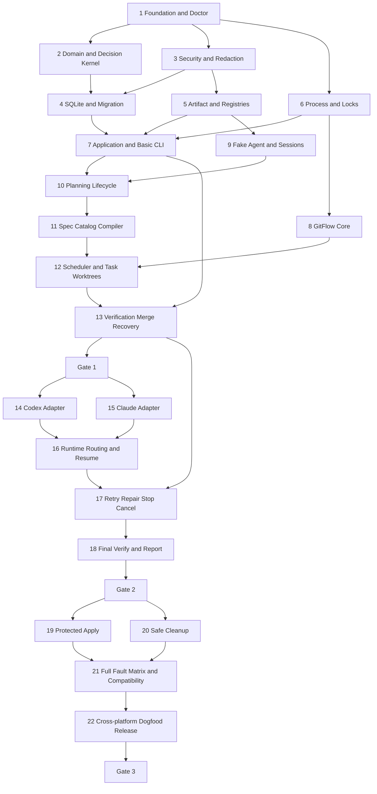

# CFlow Demo Implementation Plan

> **For agentic workers:** REQUIRED SUB-SKILL: Use superpowers:subagent-driven-development (recommended) or superpowers:executing-plans to implement this plan task-by-task. Steps use checkbox (`- [ ]`) syntax for tracking.

| Field | Value |
|---|---|
| Status | Approved |
| Version | 0.1 |
| Created | 2026-08-02 |
| Updated/approved | 2026-08-03 |

**Goal:** Build the approved CFlow Demo as a local-first Go CLI that drives a recoverable, auditable, two-Provider Plan-to-Done workflow from requirement discussion through protected Apply.

**Architecture:** A concrete Application seam coordinates a pure Decision Kernel, SQLite State Store, immutable Artifact Store, typed external Effects, GitFlow, Workflow Compiler, Scheduler, Verification Engine, Agent Runtime, and Recovery Engine. SQLite owns mutable lifecycle state and authoritative Event sequence; immutable files, Git, processes, and evidence remain independently observed facts that Recovery reconciles before mutation.

**Tech Stack:** Go 1.26.5, Cobra 1.10.2, `database/sql` with `modernc.org/sqlite` 1.54.0, `go.yaml.in/yaml/v3` 3.0.4, `golang.org/x/sys` 0.47.0, `golang.org/x/term` 0.45.0, `golang.org/x/sync` 0.22.0, standard-library `testing`, `embed`, `os/exec`, `encoding/json`, `bufio`, and `log/slog`.

## Authority and exact inputs

> **2026-08-07 已确认变更**：本 Plan（line-oriented Demo 的 Task 1–22 / Gate 1–3）已被确认的 TUI Workflow 方向取代。权威 TUI 设计见 `docs/superpowers/specs/2026-08-07-cflow-tui-workflow-design.md`；TUI 实施顺序见 `docs/superpowers/plans/2026-08-07-cflow-tui-workflow-implementation-plan.md`。本文件作为历史基线保留；其中包含的 Safety Invariant 全部保留。

- Approved PRD: `docs/cflow-prd.md` v0.2, SHA-256 `28765291866c197dbef2124c5e0bf066e3a3bebba1c72a85f9f99b18e00f66de`.
- Approved design: `docs/cflow-demo-design.md` v0.1, SHA-256 `165bfe3867e514e021f62c673d46b19ceaca90ab0ba95ccfe3db82f0b677460a`.
- Canonical domain language: `CONTEXT.md`.
- This Plan fixes implementation-level names and dependency versions. A change to a product invariant, deep-module boundary, approval model, or fact authority requires a successor PRD/design revision before implementation continues.
- The user approved this Plan and selected Subagent-Driven execution on 2026-08-03. Implementation of the predecessor line-oriented Demo is authorized in a separate Claude Code session; this document describes that historical Demo only.

## Global Constraints

- Use Go 1.26.5 and set `go 1.26.0` plus `toolchain go1.26.5` in `go.mod`.
- Use local module path `cflow.local/cflow`; do not infer or create a remote repository identity.
- Build with `CGO_ENABLED=0`; the release must remain one executable with embedded migrations, schemas, prompts, and protocol registry.
- Support macOS and Linux directly; Windows Demo support is WSL only.
- Never invoke a shell. Every external process receives a validated executable and argv slice through Process Supervisor.
- Never auto-push, fetch, create a PR, change a remote Ref, initialize a target repository, create its first Commit, stash user changes, or change global/local Git or Provider configuration.
- Never treat Agent prose, Provider exit code, or one database field as final success.
- Only Decision Kernel can authorize lifecycle transitions. Effect executors return facts and evidence.
- Planner, Checker, Implementer, Repairer, Task Reviewer, and Final Reviewer use independent Session lineages.
- A Coding Task requires append-only Commit evidence, a Git-clean Worktree, write-scope compliance, deterministic Verification, and independent Review before Merge.
- All Retry budgets are finite. A Retry creates a successor Attempt and never reopens a terminal Attempt.
- Reconcile SQLite, immutable Artifacts, Git, Worktrees, OS processes, locks, and evidence before every mutation and after abnormal exit.
- CFlow-created directories are `0700`; sensitive files are born `0600`; unsafe existing paths fail closed and are never silently chmodded.
- Redact Provider, user, repository, and tool text before terminal display, persistence, Context Bundle creation, or export. Raw secret-bearing bytes are never stored.
- `CFLOW_HOME/config.yaml` is strict and cannot contain credentials, scripts, or raw command strings. Approved Workflows bind resolved configuration hashes immutably.
- Gate 1 and Gate 2 artifacts must say `Internal Candidate`; only Gate 3 may produce `Demo Complete Candidate`.
- End every implementation task with targeted tests, `go test ./...`, `go vet ./...`, a Git-visible clean check, and one primary focused implementation Commit. Reviewer-mandated corrections may add narrowly scoped follow-up fix Commits before the task is marked complete; review and the progress ledger must cover the full recorded base-to-head range.
- Never modify `docs/cflow-prd.md`, `docs/cflow-demo-design.md`, `CONTEXT.md`, or this Plan during implementation merely to make failing code conform; stop for explicit design review when an invariant cannot be implemented.

## Dependency manifest

The first implementation Commit pins only these direct non-standard modules:

```text
github.com/spf13/cobra v1.10.2
go.yaml.in/yaml/v3 v3.0.4
golang.org/x/sync v0.22.0
golang.org/x/sys v0.47.0
golang.org/x/term v0.45.0
modernc.org/sqlite v1.54.0
```

`modernc.org/libc` must resolve to the exact version required by `modernc.org/sqlite` 1.54.0 and remain locked by `go.sum`; do not independently upgrade it. Tests use the standard library and do not add a mocking framework. Dependency changes require a dedicated reviewable Commit with license, CGO, platform, and binary-size evidence.

Version evidence was checked on 2026-08-02 against the [official Go release history](https://go.dev/doc/devel/release), [Cobra releases](https://github.com/spf13/cobra/releases), and Go package records for [`modernc.org/sqlite`](https://pkg.go.dev/modernc.org/sqlite), [`go.yaml.in/yaml/v3`](https://pkg.go.dev/go.yaml.in/yaml/v3), [`golang.org/x/sys`](https://pkg.go.dev/golang.org/x/sys), [`golang.org/x/term`](https://pkg.go.dev/golang.org/x/term), and [`golang.org/x/sync`](https://pkg.go.dev/golang.org/x/sync). Task 1 must still let `go mod tidy` resolve and lock all transitive checksums without changing these direct pins.

## Execution discipline

1. Work in a feature Worktree created at execution time; do not implement on the user's current branch.
2. Execute tasks in numeric order unless the dependency line explicitly permits parallel work.
3. Red means the new targeted test fails for the stated missing behavior, not because the package does not compile for unrelated reasons.
4. Green means the targeted test, the package test, `go test ./...`, and `go vet ./...` pass.
5. Before every Commit run `git status --short`; stage only paths listed by the current task.
6. After every Commit require `git status --porcelain` to be empty. If it is not empty, stop and account for each path before continuing. A task with reviewer-mandated fix Commits is still one task and is incomplete until the full base-to-head range passes re-review.
7. At each Gate, build a fresh candidate with `CGO_ENABLED=0`, record its SHA-256 and source Commit, run the Gate script, and store the evidence under `test-artifacts/` outside tracked source files.
8. Do not run real Codex or Claude E2E until Gate 1 passes and the user explicitly authorizes Provider execution and its potential network/cost effects.

## File responsibility map

```text
cmd/cflow/main.go                         process entry point; no domain logic
internal/cli/root.go                      Cobra root, stable exit mapping, signal translation
internal/cli/commands.go                  complete command tree and argument validation
internal/cli/render.go                    line-oriented Views, Findings and evidence references
internal/app/application.go               concrete Query/Execute seam and effect loop
internal/app/commands.go                  closed Command/Query/Outcome definitions
internal/app/effects.go                   closed typed Effect execution dispatcher
internal/config/config.go                 strict config decode and precedence resolution
internal/model/ids.go                     opaque IDs and deterministic test source
internal/model/state.go                   Stages, statuses and aggregate state
internal/model/artifacts.go               Artifact, Approval and policy references
internal/model/runtime.go                 Node, Attempt, Run, Session, Process and evidence facts
internal/model/fault.go                   stable fault codes and dispositions
internal/decision/kernel.go               pure transition dispatcher
internal/decision/workflow.go             workflow/plan/approval decisions
internal/decision/execution.go            node/attempt/retry/quiesce/stop decisions
internal/decision/apply_cleanup.go         Apply, Cancel and Cleanup decisions
internal/compile/compiler.go               deterministic DAG skeleton and restricted Patch validation
internal/compile/schema.go                 Spec, Catalog, Workflow and Patch validation
internal/schedule/scheduler.go             pure readiness, lock and dispatch selection
internal/store/store.go                    concrete SQLite aggregate transaction seam
internal/store/schema.go                   migration runner, compatibility and backup protocol
internal/store/queries.go                  aggregate hydration and read projections
internal/artifact/store.go                 atomic immutable Artifact read/write/resolve
internal/artifact/canonical.go             canonical serialization and SHA-256 rules
internal/agent/adapter.go                  Provider Adapter interface and unified events
internal/agent/runtime.go                  protocol validation, Session lineage and Context Bundles
internal/agent/registry.go                 embedded Provider and Prompt registries
internal/agent/fake/adapter.go             deterministic Fake Provider
internal/agent/codex/adapter.go            Codex argv, JSONL dialect, Session start/resume/cancel
internal/agent/claude/adapter.go           Claude argv, stream-json dialect, Session start/resume/cancel
internal/gitflow/gitflow.go                closed Git queries/operations and structured facts
internal/gitflow/worktrees.go              Planning, Integration, Task and Apply Worktrees
internal/gitflow/policy.go                 identity/signing preflight, fingerprints and quarantine
internal/verify/catalog.go                 Catalog policy and command identity validation
internal/verify/engine.go                  deterministic execution and evidence manifests
internal/process/supervisor.go             process seam, bounded streams and lifecycle
internal/process/os_adapter.go             production argv-only OS process Adapter
internal/process/fake_adapter.go           deterministic process Adapter for tests
internal/recovery/recovery.go               ordered fact collection and reconciliation
internal/security/paths.go                 owner/mode/canonical/symlink guards
internal/security/redact.go                streaming versioned redaction
internal/observe/events.go                 redacted structured logging and event export
internal/observe/report.go                 final report read model
internal/platform/locks.go                 lock order and Advisory Lock API
internal/platform/process_unix.go          Darwin/Linux process identity and group mechanics
migrations/001_initial.sql                 initial normalized State Store schema
migrations/002_cleanup_apply.sql           forward-only Apply/Cleanup schema evolution fixture
schemas/plan-envelope.json                 embedded Plan envelope schema
schemas/spec.json                          embedded Spec schema
schemas/catalog.json                       embedded Verification Catalog schema
schemas/workflow.json                      embedded Workflow IR schema
schemas/workflow-patch.json                embedded restricted Patch schema
prompts/requirement-discussion.md          versioned requirement prompt
prompts/plan-generation.md                 versioned Planner prompt
prompts/plan-check.md                      versioned Checker prompt
prompts/spec-generation.md                 versioned Spec prompt
prompts/schedule-patch.md                  versioned schedule-advice prompt
prompts/implementation.md                  versioned Implementer prompt
prompts/repair.md                          versioned Repairer prompt
prompts/task-review.md                     versioned Task Reviewer prompt
prompts/final-review.md                    versioned Final Reviewer prompt
protocols/providers.yaml                   embedded Provider protocol bindings
tests/testdata/                             dialect, Artifact, state and fault fixtures
tests/integration/                          real SQLite/Git/process integration tests
tests/e2e/calculator/                       deterministic calculator Fixture repository template
tests/e2e/fake_flow_test.go                 Gate 1 Plan-to-Integration path
tests/e2e/cross_provider_test.go            opt-in Gate 2 real Codex/Claude path
tests/e2e/dogfood_test.go                   opt-in Gate 3 self-hosting path
scripts/gate1.sh                            deterministic Core candidate evidence
scripts/gate2.sh                            real Runtime candidate evidence
scripts/gate3.sh                            Release Acceptance evidence
README.md                                   stage-accurate usage, trust boundaries and limitations
```

Files stay focused. If a planned file exceeds roughly 500 non-test lines, split it by the responsibilities named above without adding a new public module seam.

## Stable interface ledger

These names are fixed across tasks:

```go
// internal/app
type Application struct { /* private dependencies */ }
func (a *Application) Query(context.Context, Query) (View, error)
func (a *Application) Execute(context.Context, Command) (Outcome, error)

// internal/decision
func Decide(model.State, model.Input) (model.Decision, error)

// internal/store
type Store struct { /* private *sql.DB */ }
func Open(context.Context, OpenOptions) (*Store, error)
func (s *Store) View(context.Context, StoreQuery) (StoreView, error)
func (s *Store) Transact(context.Context, model.AggregateVersion, func(model.State) (model.Decision, error)) (model.CommittedDecision, error)

// internal/artifact
type Store struct { /* private root and registry */ }
func (s *Store) Put(context.Context, PutRequest) (model.ArtifactRef, error)
func (s *Store) Get(context.Context, model.ArtifactRef) ([]byte, error)
func (s *Store) Resolve(context.Context, ResolveRequest) (model.ArtifactRef, error)
func Canonicalize(model.ArtifactEnvelope) ([]byte, error)
func HashCanonical([]byte) string

// internal/compile
type Compiler struct { /* private schema and limits */ }
func (c *Compiler) Compile(context.Context, CompileRequest) (CompiledWorkflow, error)

// internal/schedule
type Scheduler struct{}
func (Scheduler) Next(model.GraphSnapshot, model.DispatchPolicy) model.DispatchDecision

// internal/process
type Supervisor interface {
    Start(context.Context, ProcessSpec) (Handle, Events, error)
    Signal(context.Context, Handle, Signal) error
    Wait(context.Context, Handle) (Exit, error)
    Inspect(context.Context, ProcessIdentity) (ProcessFact, error)
}

// internal/agent
type Adapter interface {
    Detect(context.Context) (Installation, error)
    Start(context.Context, StartRequest) (Run, error)
    Resume(context.Context, ResumeRequest) (Run, error)
    Cancel(context.Context, RunHandle) error
    Inspect(context.Context, ProviderSessionID) (SessionFact, error)
}

// internal/gitflow
type GitFlow struct { /* private process.Supervisor */ }
func (g *GitFlow) Observe(context.Context, GitQuery) (GitFacts, error)
func (g *GitFlow) Execute(context.Context, GitOperation) (GitResult, error)

// internal/verify
type Engine struct { /* private Supervisor and GitFlow */ }
func (e *Engine) ValidateCatalog(context.Context, model.CatalogRef) (ValidatedCatalog, error)
func (e *Engine) Run(context.Context, VerificationRequest) (model.EvidenceManifest, error)

// internal/recovery
type RecoveryEngine struct { /* private fact collectors and kernel */ }
func (e *RecoveryEngine) Reconcile(context.Context, Scope) (ReconciliationOutcome, error)
```

Do not introduce exported repository-per-table interfaces, a generic plugin interface, a generic workflow step executor, or arbitrary command callbacks.

## Task dependency graph



Tasks 2 and 3 may proceed in parallel after Task 1. Tasks 4, 5, and 6 may proceed in parallel once their incoming dependencies pass. Tasks 14 and 15 may proceed in parallel after Gate 1. No other parallelization is permitted by this Plan.

Authoritative execution order is Tasks 1–13 for Gate 1, Tasks 14–18 for Gate 2, and Tasks 19–22 for Gate 3. Use task numbers and the dependency graph rather than physical section proximity when navigating this document.

---

## Gate 1 — Deterministic Core

### Task 1: Toolchain, build identity, strict configuration, and read-only Doctor

**Depends on:** approved Plan and a user-provided Go 1.26.5 toolchain. If `go version` is unavailable or not 1.26.5, stop; do not install or alter global toolchains automatically.

**Files:**
- Create: `go.mod`
- Create: `go.sum`
- Create: `cmd/cflow/main.go`
- Create: `internal/cli/root.go`
- Create: `internal/cli/root_test.go`
- Create: `internal/config/config.go`
- Create: `internal/config/config_test.go`
- Create: `internal/observe/build.go`
- Create: `README.md`
- Create: `.gitignore`

**Interfaces:**
- Produces: `config.Load(path string) (File, error)`, `config.Resolve(File, Overrides) (Resolved, error)`, `cli.NewRoot(Dependencies) *cobra.Command`, and `observe.BuildInfo`.
- Consumes: no project code.

**Acceptance:** `cflow version`, `cflow help`, and read-only `cflow doctor` run without creating `CFLOW_HOME`; unknown configuration keys fail with exit class 4; build output reports version, source Commit, dirty flag, Go version, OS, architecture, and embedded-registry hashes.

- [ ] **Step 1: Verify the exact implementation toolchain**

Run:

```bash
go version
```

Expected: output starts with `go version go1.26.5`. Any other result blocks implementation and is reported to the user.

- [ ] **Step 2: Write failing configuration and CLI tests**

Add table tests whose central assertions are:

```go
func TestLoadRejectsUnknownKeys(t *testing.T) {
    path := writeConfig(t, "concurrency: 2\nunknown_key: true\n")
    _, err := config.Load(path)
    if err == nil || !strings.Contains(err.Error(), "unknown_key") {
        t.Fatalf("expected unknown-key error, got %v", err)
    }
}

func TestResolvePrecedence(t *testing.T) {
    got, err := config.Resolve(config.File{Concurrency: new(2)}, config.Overrides{Concurrency: new(3)})
    if err != nil || got.Concurrency != 3 {
        t.Fatalf("got %#v, %v", got, err)
    }
}

func TestVersionDoesNotCreateHome(t *testing.T) {
    home := filepath.Join(t.TempDir(), "absent")
    out, code := runCLI(t, home, "version")
    if code != 0 || strings.Contains(out, "unknown") || pathExists(home) {
        t.Fatalf("code=%d out=%q homeExists=%v", code, out, pathExists(home))
    }
}
```

- [ ] **Step 3: Run the tests to prove the behavior is missing**

Run: `go test ./internal/config ./internal/cli -run 'TestLoadRejectsUnknownKeys|TestResolvePrecedence|TestVersionDoesNotCreateHome'`

Expected: FAIL because the packages and functions do not exist.

- [ ] **Step 4: Initialize the module and pin the dependency manifest**

Create `go.mod` with:

```go
module cflow.local/cflow

go 1.26.0

toolchain go1.26.5
```

Run the six exact `go get module@version` commands from the Dependency manifest, then `go mod tidy`. Inspect `go.mod` and `go.sum`; require `modernc.org/sqlite` and its resolved `modernc.org/libc` to be version-pinned and require no CGO-only direct dependency.

- [ ] **Step 5: Implement strict configuration and the non-mutating command root**

Use `yaml.Decoder.KnownFields(true)`, reject credentials/scripts/command strings by schema absence, and implement precedence explicitly:

```go
func Resolve(file File, cli Overrides) (Resolved, error) {
    out := builtInSafeDefaults()
    applyFile(&out, file)
    applyOverrides(&out, cli)
    return validate(out)
}
```

`main.go` calls `cli.NewRoot`, maps the returned typed error to one central numeric exit code, and contains no Store, Git, Provider, or filesystem logic. `doctor` initially reports build/tool availability and labels unimplemented stateful checks `NOT_YET_AVAILABLE`; it must remain read-only.

- [ ] **Step 6: Run quality and single-binary checks**

Run:

```bash
gofmt -w cmd internal
go test ./internal/config ./internal/cli
go test ./...
go vet ./...
CGO_ENABLED=0 go build -trimpath -o /tmp/cflow-task1 ./cmd/cflow
/tmp/cflow-task1 version
```

Expected: all tests and vet pass; build succeeds with CGO disabled; version output contains no `unknown`; `file /tmp/cflow-task1` reports one native executable.

- [ ] **Step 7: Commit the foundation**

```bash
git add go.mod go.sum cmd/cflow internal/cli internal/config internal/observe README.md .gitignore
git commit -m "chore: establish cflow toolchain and cli foundation"
git status --porcelain
```

Expected: Commit succeeds and final status output is empty.

### Task 2: Canonical domain model and pure Decision Kernel

**Depends on:** Task 1.

**Files:**
- Create: `internal/model/ids.go`
- Create: `internal/model/state.go`
- Create: `internal/model/artifacts.go`
- Create: `internal/model/runtime.go`
- Create: `internal/model/fault.go`
- Create: `internal/model/model_test.go`
- Create: `internal/decision/kernel.go`
- Create: `internal/decision/workflow.go`
- Create: `internal/decision/execution.go`
- Create: `internal/decision/apply_cleanup.go`
- Create: `internal/decision/kernel_test.go`

**Interfaces:**
- Produces: all canonical types in the Stable interface ledger and `decision.Decide(model.State, model.Input) (model.Decision, error)`.
- Consumes: `CONTEXT.md` vocabulary only; no I/O package.

**Acceptance:** the compiler prevents invalid enum construction outside constructors where practical; the Kernel is deterministic; illegal transitions, Agent-declared success, Approval hash mismatch, Retry exhaustion, Quiescing, interruption, cancellation, and Workflow failure semantics match PRD tables.

- [ ] **Step 1: Write the transition matrix tests first**

Encode each legal and illegal transition as data, including these mandatory cases:

```go
func TestAgentCompletionCannotCompleteNode(t *testing.T) {
    state := fixtureRunningAgentTask()
    input := model.AgentEventInput{Kind: model.AgentClaimsComplete}
    _, err := decision.Decide(state, input)
    assertFaultCode(t, err, model.CodeUntrustedCompletion)
}

func TestRetryExhaustionBlocksInsteadOfWorkflowFailed(t *testing.T) {
    state := fixtureAttemptFailedWithBudget(0)
    got, err := decision.Decide(state, model.ReconcileInput{})
    requireNoError(t, err)
    requireStatus(t, got, model.StageExecution, model.RuntimeBlocked)
}

func TestApprovalRequiresExactHashes(t *testing.T) {
    state := fixtureAwaitingExecutionApproval("workflow-a")
    _, err := decision.Decide(state, model.ExecutionApprovalInput{WorkflowHash: "workflow-b"})
    assertFaultCode(t, err, model.CodeApprovalInputChanged)
}
```

- [ ] **Step 2: Run the Kernel tests red**

Run: `go test ./internal/decision -run 'TestAgentCompletion|TestRetryExhaustion|TestApprovalRequiresExactHashes'`

Expected: FAIL because the model and Kernel are absent.

- [ ] **Step 3: Define concrete state and input unions**

Use closed string-backed enums with validating constructors and exhaustive switch helpers. `model.State` contains current aggregate data; `model.Decision` contains state mutations, Events, and at most one next typed Effect Intent. Include exact `Fault` fields from the design and a compiled fault-policy table that declares retry charge, dispatch closure, safety-stop scope, and successor permission for every Code.

- [ ] **Step 4: Implement pure decisions by domain concern**

The dispatcher shape is fixed:

```go
func Decide(state model.State, input model.Input) (model.Decision, error) {
    if err := model.ValidateState(state); err != nil {
        return model.Decision{}, model.InvariantFault(err)
    }
    switch in := input.(type) {
    case model.WorkflowCommandInput:
        return decideWorkflow(state, in)
    case model.EffectResultInput:
        return decideEffectResult(state, in)
    case model.ReconcileInput:
        return decideReconcile(state, in)
    default:
        return model.Decision{}, model.InvalidInputFault("unsupported input")
    }
}
```

No function in `internal/model` or `internal/decision` imports `database/sql`, `os`, `os/exec`, `path/filepath`, or a CFlow infrastructure package.

- [ ] **Step 5: Add property tests for invariants**

Generate bounded sequences of Commands and Effect Results and assert: Event sequence requests never decrease; terminal Attempt facts never mutate; Retry creates `attempt_number+1`; Completed never changes Target; quarantined refs never become runnable; Decision output is byte-identical for identical State/Input.

- [ ] **Step 6: Run quality checks and commit**

Run: `gofmt -w internal/model internal/decision && go test ./internal/model ./internal/decision && go test ./... && go vet ./...`

Expected: PASS.

```bash
git add internal/model internal/decision
git commit -m "feat: define cflow domain and decision kernel"
git status --porcelain
```

Expected: empty final status.

## Gate 2 task specifications — execute only after Tasks 1–13

Gate 2 begins only after committed Gate 1 evidence passes. The initial verified local protocol baselines are Codex CLI `0.141.0` and Claude Code `2.1.185`; broader version ranges may be admitted only by adding captured help/event fixtures and passing the same dialect contract tests. Detection never starts a paid model request.

### Task 14: Codex Adapter with JSONL start, Session capture, resume, cancel, and protocol fixtures

**Depends on:** Gate 1.

**Files:**
- Create: `internal/agent/codex/adapter.go`
- Create: `internal/agent/codex/dialect.go`
- Create: `internal/agent/codex/adapter_test.go`
- Create: `tests/testdata/providers/codex/0.141.0/help.txt`
- Create: `tests/testdata/providers/codex/0.141.0/exec-help.txt`
- Create: `tests/testdata/providers/codex/0.141.0/resume-help.txt`
- Create: `tests/testdata/providers/codex/0.141.0/start-valid.jsonl`
- Create: `tests/testdata/providers/codex/0.141.0/resume-valid.jsonl`
- Create: `tests/testdata/providers/codex/0.141.0/protocol-invalid.jsonl`
- Create: `tests/testdata/providers/codex/0.141.0/session-conflict.jsonl`
- Modify: `protocols/providers.yaml`
- Modify: `internal/agent/registry_test.go`

**Interfaces:**
- Produces: `codex.New(process.Supervisor, RegistryBinding) agent.Adapter`.
- Consumes: Agent Adapter contract, Process Supervisor, Redactor, and exact Registry Binding.

**Acceptance:** Detect hashes executable and parses version; Start uses `codex exec --json --output-schema <file> -` with `-C <worktree>` and approved optional `--model`; Resume uses `codex exec resume --json --output-schema <file> <session-id> -`; no danger/bypass/ignore flags are added; JSONL Session and completion events validate against captured fixtures; unknown versions/events fail closed.

- [ ] **Step 1: Capture read-only protocol fixtures**

Run and save redacted outputs from:

```bash
codex --version
codex exec --help
codex exec resume --help
```

Expected baseline: `codex-cli 0.141.0`; help confirms `--json`, `--output-schema`, `-C/--cd`, and explicit `resume [SESSION_ID] [PROMPT]`. Hash the executable and fixture files. Do not run a model request in this step.

- [ ] **Step 2: Write dialect contract tests**

```go
func TestStartArgvContainsNoBypassFlags(t *testing.T) {
    req := fixtureCodexStart()
    argv := codex.StartArgv(req)
    requireExactArgs(t, argv, "exec", "--json", "--output-schema", req.SchemaPath, "-C", req.Worktree, "-")
    requireAbsentArgs(t, argv, "--dangerously-bypass-approvals-and-sandbox", "--skip-git-repo-check", "--ignore-user-config")
}
```

Add golden tests for Session event extraction, structured completion, malformed/unknown event, conflicting IDs, resume not found, cancellation result, stderr redaction, version mismatch, and executable hash drift.

- [ ] **Step 3: Run Codex tests red**

Run: `go test ./internal/agent/codex -run 'TestStartArgv|TestDialect|TestDetect|TestResume'`

Expected: FAIL because Codex Adapter is absent.

- [ ] **Step 4: Implement exact binding and dialect**

Build argv only from typed request fields allowed by the Registry. Feed prompt through stdin, schema through a managed immutable file, and cwd through `-C`. Parse each JSONL frame into the unified event contract. A Provider success exit without validated terminal structured output is Protocol violation. Cancel delegates to controlled process stop and preserves partial redacted events.

- [ ] **Step 5: Run offline protocol tests and opt-in smoke detection**

Run: `gofmt -w internal/agent/codex && go test -race ./internal/agent/codex ./internal/agent -count=20 && go test ./... && go vet ./...`

Expected: PASS without network. Run a separate read-only `cflow doctor` fixture and require Codex `SUPPORTED` only for the captured binding.

- [ ] **Step 6: Commit Codex Adapter**

```bash
git add internal/agent/codex protocols/providers.yaml internal/agent/registry_test.go tests/testdata/providers/codex
git commit -m "feat: add fail-closed codex adapter"
git status --porcelain
```

Expected: empty final status.

### Task 15: Claude Adapter with stream-json start, Session capture, resume, cancel, schema, and budget

**Depends on:** Gate 1. May run in parallel with Task 14.

**Files:**
- Create: `internal/agent/claude/adapter.go`
- Create: `internal/agent/claude/dialect.go`
- Create: `internal/agent/claude/adapter_test.go`
- Create: `tests/testdata/providers/claude/2.1.185/help.txt`
- Create: `tests/testdata/providers/claude/2.1.185/start-valid.jsonl`
- Create: `tests/testdata/providers/claude/2.1.185/resume-valid.jsonl`
- Create: `tests/testdata/providers/claude/2.1.185/protocol-invalid.jsonl`
- Create: `tests/testdata/providers/claude/2.1.185/session-conflict.jsonl`
- Modify: `protocols/providers.yaml`
- Modify: `internal/agent/registry_test.go`

**Interfaces:**
- Produces: `claude.New(process.Supervisor, RegistryBinding) agent.Adapter`.
- Consumes: Agent Adapter contract, Process Supervisor, Redactor, and exact Registry Binding.

**Acceptance:** Detect binds executable/version/hash; Start uses noninteractive `claude --print --input-format stream-json --output-format stream-json --json-schema <json> --max-budget-usd <amount>` with optional approved model; Resume adds `--resume <session-id>`; existing Provider defaults remain in force; no permission-bypass/allowlist mutation is added; events and structured result validate; unknown protocol fails closed.

- [ ] **Step 1: Capture read-only Claude protocol fixtures**

Run and save redacted output from:

```bash
claude --version
claude --help
```

Expected baseline: `2.1.185 (Claude Code)`; help confirms `--print`, input/output `stream-json`, `--json-schema`, `--max-budget-usd`, `--resume`, and `--session-id`. Hash the executable and fixtures. Do not run a model request.

- [ ] **Step 2: Write exact argv and dialect tests**

```go
func TestClaudeArgvPreservesProviderPermissionDefaults(t *testing.T) {
    req := fixtureClaudeStart()
    argv := claude.StartArgv(req)
    requireContainsArgs(t, argv, "--print", "--input-format", "stream-json", "--output-format", "stream-json")
    requireContainsArgs(t, argv, "--json-schema", req.SchemaJSON, "--max-budget-usd", req.MaxBudgetUSD)
    requireAbsentArgs(t, argv, "--dangerously-skip-permissions", "--allow-dangerously-skip-permissions", "--permission-mode", "--allowedTools", "--disallowedTools")
}
```

Cover stream ordering, Session capture, schema result, partial frames, Resume missing, budget exceeded, cancel, version mismatch, executable drift, and Authentication Unknown distinct from Protocol unsupported.

- [ ] **Step 3: Run Claude tests red**

Run: `go test ./internal/agent/claude -run 'TestClaudeArgv|TestDialect|TestDetect|TestResume'`

Expected: FAIL because Claude Adapter is absent.

- [ ] **Step 4: Implement the Adapter and stream dialect**

Serialize realtime input as validated stream-json frames, close stdin deterministically, parse output frame-by-frame, require one consistent Session ID and one schema-valid terminal result, and delegate process lifecycle to Supervisor. Budget, model, prompt, schema, cwd, and Session are the only request-controlled argv fields admitted by the binding.

- [ ] **Step 5: Run offline contract tests and commit**

Run: `gofmt -w internal/agent/claude && go test -race ./internal/agent/claude ./internal/agent -count=20 && go test ./... && go vet ./...`

Expected: PASS without network; read-only doctor reports the captured Claude binding as Supported.

```bash
git add internal/agent/claude protocols/providers.yaml internal/agent/registry_test.go tests/testdata/providers/claude
git commit -m "feat: add fail-closed claude adapter"
git status --porcelain
```

Expected: empty final status.

### Task 16: Cross-Provider routing, real parallel runtime, Session resume/fallback, and protocol drift gates

**Depends on:** Tasks 14 and 15.

**Files:**
- Modify: `internal/agent/runtime.go`
- Modify: `internal/app/effects.go`
- Modify: `internal/decision/execution.go`
- Modify: `internal/schedule/scheduler.go`
- Modify: `internal/config/config.go`
- Modify: `internal/cli/render.go`
- Create: `internal/agent/routing_test.go`
- Create: `internal/app/runtime_test.go`
- Create: `tests/integration/provider_routing_test.go`

**Interfaces:**
- Produces: immutable `RoutingPolicy`, per-Purpose route/fallback resolution, cross-Provider Context Bundle handoff, protocol compare-and-swap before every Start/Resume.
- Consumes: both real Adapters, approved routing/model/budget/config hashes, Scheduler, and Agent Runtime.

**Acceptance:** different Tasks can run Codex/Claude concurrently; every Purpose has an approved route; Planner/Checker and Implementer/Reviewer remain independent even on same Provider; Resume checks operation-specific capability; fallback records Lost original/successor lineage and charges an automatic Attempt; protocol/config drift pauses before start without spending Retry.

- [ ] **Step 1: Write routing and fallback tests**

```go
func TestBindingDriftStopsBeforeAttemptAllocation(t *testing.T) {
    fx := approvedRuntimeFixture(t)
    fx.ReplaceProviderBinary("codex", changedHashBinary(t))
    err := fx.Dispatch("S01")
    assertFaultCode(t, err, model.CodeProviderBindingChanged)
    fx.RequireAttemptCount("S01", 0)
    fx.RequireProviderStarts(0)
}
```

Cover route absent, fallback unapproved, Resume supported for Start but not Resume, same Provider/different Session accepted, same Session/different Purpose rejected, Context Bundle redaction, budget charge on automatic fallback, and user Ctrl+C interruption not charging Retry.

- [ ] **Step 2: Run Runtime tests red**

Run: `go test ./internal/agent ./internal/app ./tests/integration -run 'TestBindingDrift|TestRouting|TestFallback'`

Expected: FAIL because cross-Provider routing is incomplete.

- [ ] **Step 3: Implement immutable routing resolution and CAS**

Resolve Purpose → ordered approved bindings, model, budget, timeout, prompt, and Provider default-permission disclosure at Execution Approval. Before every operation re-detect executable path/hash/version/dialect/capabilities and compare to the approved binding. Do not allocate Attempt or start a process on mismatch.

- [ ] **Step 4: Implement resume/fallback lineage and live parallelism**

Attempt native Resume only when the exact binding supports Resume. On nonrecoverable Resume, preserve Lost Session, create immutable Context Bundle, validate fallback capabilities, allocate successor Session and automatic Attempt, and route through the same Scheduler/Resource locks. Never copy Provider credentials or unredacted transcript.

- [ ] **Step 5: Run deterministic dialect-equivalent concurrency tests and commit**

Run: `gofmt -w internal/agent internal/app internal/decision internal/schedule internal/config internal/cli tests/integration && go test -race ./internal/agent ./internal/app ./tests/integration -count=20 && go test ./... && go vet ./...`

Expected: PASS; fixture timestamps prove Codex/Claude dialect Adapters overlap while retaining independent Session IDs.

```bash
git add internal/agent internal/app internal/decision internal/schedule internal/config internal/cli tests/integration/provider_routing_test.go
git commit -m "feat: route and resume cross-provider sessions"
git status --porcelain
```

Expected: empty final status.

### Task 17: Retry, Repair, Quiescing, controlled Pause, logical Cancel, Commit Policy Safety Stop, and complete Recovery

**Depends on:** Tasks 13 and 16.

**Files:**
- Modify: `internal/decision/execution.go`
- Modify: `internal/decision/apply_cleanup.go`
- Modify: `internal/app/application.go`
- Modify: `internal/app/effects.go`
- Modify: `internal/gitflow/policy.go`
- Modify: `internal/gitflow/worktrees.go`
- Modify: `internal/recovery/recovery.go`
- Modify: `internal/process/supervisor.go`
- Modify: `internal/cli/commands.go`
- Modify: `internal/cli/root.go`
- Create: `internal/app/repair_stop_test.go`
- Create: `internal/recovery/fault_matrix_test.go`
- Create: `tests/integration/stop_cancel_test.go`
- Create: `tests/integration/policy_drift_test.go`

**Interfaces:**
- Produces: `RetryTask`, `RepairTask`, `PauseWorkflow`, `CancelWorkflow`, Safety Stop, Quarantine/Replacement/Reconciliation Manifest, and complete mutation-time Recovery behavior.
- Consumes: Decision fault policy, Supervisor, GitFlow, Agent Runtime, Scheduler dispatch gate, Store, and Artifact Store.

**Acceptance:** every Retry is bounded and immutable; dirty repair reuses exact unchanged Worktree; nonretryable sibling failure enters Quiescing with fixed running snapshot; Ctrl+C follows 10+2 seconds and second-interrupt escalation; Cancel preserves all evidence and recovery only finishes cancellation; Commit policy checked at least once/second stops all work, quarantines window Commits, and permits only approved replacement paths.

- [ ] **Step 1: Write the failure-state matrix tests**

```go
func TestQuiescingNeverDispatchesReadySibling(t *testing.T) {
    fx := parallelFailureFixture(t)
    fx.FailNonRetryable("S01")
    fx.MarkReady("S03")
    fx.SettleRunning("S02")
    fx.RequireNeverStarted("S03")
    fx.RequireRunStatus(model.RunBlocked)
}

func TestCancelRecoveryCannotResumeScheduler(t *testing.T) {
    fx := crashDuringCancel(t)
    mustReconcile(t, fx)
    fx.RequireProviderStarts(0)
    fx.RequireStatus(model.RuntimeCancelled)
    fx.RequireEvidencePreserved()
}
```

Cover Retry budget charge/no-charge table, dirty Worktree unchanged/drifted, append-only repair Commit, first/second Ctrl+C, orphan child quarantine, policy drift without Commit, drift-window Commit, unique audit Ref, contaminated branch never verifies, replacement categories, unified replacement Execution Approval, and Apply unaffected until Gate 3.

- [ ] **Step 2: Run failure matrix red**

Run: `go test ./internal/app ./internal/recovery ./tests/integration -run 'TestRetry|TestRepair|TestQuiescing|TestCancel|TestPolicyDrift'`

Expected: FAIL because full failure protocols are incomplete.

- [ ] **Step 3: Implement Retry/Repair and Quiescing**

Classify faults through the compiled policy only. Automatic Retry creates successor Attempt if budget remains. Dirty Worktree Repair first CAS-checks prior end HEAD/status/fingerprint, reuses the exact Task Branch/Worktree, creates new Repair Session, and requires append-only Commit/Clean/Scope gates. Nonretryable failure atomically snapshots running Attempts, closes dispatch, lets only that snapshot settle within existing limits, then blocks.

- [ ] **Step 4: Implement controlled Pause/Cancel and crash continuation**

First SIGINT persists Stop Intent and closes dispatch, calls Adapter cancel, drains events, terminates at 10 seconds, kills at 12; second SIGINT enters escalation immediately. Mark active Attempt/Run Interrupted without Retry charge only after process facts settle and persist Checkpoint before releasing ownership. Cancel adds explicit confirmation and terminal Cancel Decision; it never deletes or rewrites any resource. Recovery of Stop/Cancel cannot reopen dispatch.

- [ ] **Step 5: Implement Commit Policy monitor, Quarantine, and replacement**

For every commit-capable process, recompute effective fingerprint no slower than once/second. Mismatch commits Safety Stop intent and closes dispatch before signaling all processes. Scan pre/post HEADs; no new Commit requires exact new policy confirmation, while any window Commit receives immutable Quarantine row and unique audit Ref. New work starts from last verified Integration HEAD on new Branch/Worktree after a replacement Execution Approval binding Quarantine Set, successor artifacts/policies, and Reconciliation Manifest categories.

- [ ] **Step 6: Run crash/race matrix and commit**

Run: `gofmt -w internal tests/integration && go test -race ./internal/app ./internal/recovery ./internal/process ./internal/gitflow ./tests/integration -count=20 && go test ./... && go vet ./...`

Expected: PASS; each injected crash converges to one stable disposition with no duplicate external effect.

```bash
git add internal tests/integration/stop_cancel_test.go tests/integration/policy_drift_test.go
git commit -m "feat: recover bounded failures and controlled stops"
git status --porcelain
```

Expected: empty final status.

### Task 18: Final Verification, independent Final Review, execution report, full CLI, and Gate 2 evidence

**Depends on:** Task 17.

**Files:**
- Create: `internal/observe/report.go`
- Create: `internal/observe/report_test.go`
- Modify: `internal/app/commands.go`
- Modify: `internal/app/effects.go`
- Modify: `internal/decision/workflow.go`
- Modify: `internal/cli/commands.go`
- Modify: `internal/cli/render.go`
- Create: `tests/e2e/cross_provider_test.go`
- Create: `scripts/gate2.sh`
- Modify: `README.md`

**Interfaces:**
- Produces: Final Verify/Review/Completion decisions, immutable Execution Report, complete required CLI surface, and Gate 2 Runtime candidate evidence.
- Consumes: all Gate 2 modules.

**Acceptance:** all merged tasks undergo full approved deterministic verification and new Final Reviewer Session; Workflow completes only with exact Integration Commit evidence; Report includes approvals, sessions, attempts, commits, policy, verification, permissions/redaction/compatibility, risks, and binary identity; all required CLI commands work; one authorized real Codex/Claude run succeeds and is separately evidenced.

- [ ] **Step 1: Write completion and report tests**

```go
func TestFinalReviewerMustBeIndependentAndBoundToIntegrationHead(t *testing.T) {
    fx := completedTasksFixture(t)
    review := fx.ReviewWithImplementerSession()
    assertFaultCode(t, review.Err, model.CodeSessionIndependenceViolation)
    fx.ReviewWithNewSession()
    fx.AdvanceIntegrationHeadUnexpectedly()
    err := fx.Complete()
    assertFaultCode(t, err, model.CodeEvidenceSubjectChanged)
}
```

Cover missing full command, report redaction, stale Artifact hash, incomplete Finding, Provider trust-boundary disclosure, migration/security posture, Apply status shown as not run, stable Event export, and every required CLI command help/exit class.

- [ ] **Step 2: Run finalization tests red**

Run: `go test ./internal/observe ./internal/app ./internal/cli ./tests/e2e -run 'TestFinal|TestReport|TestCLI'`

Expected: FAIL because finalization/reporting are incomplete.

- [ ] **Step 3: Implement Final Verify, Final Review, and completion Decision**

Run all approved Final-Verify Catalog entries in Integration Worktree, require unchanged tracked/Git-visible state, then start a new Final Reviewer Session bound to Plan/Specs/Workflow/Integration HEAD/manifests. Completion requires every Node/Merge/evidence subject exact and no Blocking Finding; it records Completed without changing Target Branch.

- [ ] **Step 4: Implement immutable report and full line CLI**

Report is a read model over approved hashes, Git facts, Sessions, Attempts, Findings, evidence, migrations, security posture, Runtime build, and Apply state. Implement `cflow`, `list`, `status`, `resume`, `inspect`, `inspect task`, `logs`, `retry`, `pause`, `cancel`, `cleanup` dry-run entry, `dry-run`, `doctor`, and `apply` preflight entry; Gate 3 commands may return the stable not-yet-available Finding until their tasks land. No full-screen TUI yet at the time this was written (old line-oriented Demo CLI); **Superseded by the confirmed 2026-08-07 TUI workflow direction** — see `docs/superpowers/plans/2026-08-07-cflow-tui-workflow-implementation-plan.md`.

- [ ] **Step 5: Run deterministic Gate 2 suite**

Run: `gofmt -w internal tests/e2e && go test -race ./internal/... && go test ./tests/integration/... ./tests/e2e/... -run 'TestFake|TestDialectEquivalent' && go test ./... && go vet ./...`

Expected: PASS without network.

- [ ] **Step 6: Run one explicitly authorized real Cross-Provider E2E**

Preconditions: user has approved the exact Dry Run, provider routes/models/budgets, default permission trust boundary, and potential network/cost. Run only the opt-in test selected by `CFLOW_E2E_REAL=1`; never expose credentials or raw streams.

Run: `CFLOW_E2E_REAL=1 go test ./tests/e2e -run TestRealCrossProvider -count=1 -v`

Expected: PASS once with at least two parallel Tasks using Codex/Claude, independent Review Sessions, real Commits, deterministic Verification, serial Integration merges, final report, and unchanged Target Branch. Failure does not get hidden by a Fake result and must be retained as evidence.

- [ ] **Step 7: Create Gate 2 evidence and commit**

`scripts/gate2.sh` reruns Gate 1, offline protocol/routing/recovery matrices, optional real evidence validation, CGO-disabled build, binary hash, source Commit, and clean status. Manifest label is `Internal Runtime Candidate`.

```bash
git add internal tests/e2e/cross_provider_test.go scripts/gate2.sh README.md
git commit -m "feat: complete real multi-agent runtime candidate"
git status --porcelain
```

Expected: empty status. Re-run `scripts/gate2.sh` against committed source and retain external evidence before Gate 3.

## Gate 1 task specifications — Tasks 8–13

### Task 8: Project discovery, structured Git facts, Worktree primitives, and Commit Preflight

**Depends on:** Task 6.

**Files:**
- Create: `internal/gitflow/gitflow.go`
- Create: `internal/gitflow/worktrees.go`
- Create: `internal/gitflow/policy.go`
- Create: `internal/gitflow/gitflow_test.go`
- Create: `internal/gitflow/worktrees_test.go`
- Create: `internal/gitflow/policy_test.go`
- Create: `tests/integration/gitflow_test.go`

**Interfaces:**
- Produces: GitFlow ledger methods plus closed `GitQuery`, `GitOperation`, `GitFacts`, and `GitResult`; Project Key; Dirty Fingerprint; Commit Policy fingerprint.
- Consumes: Task 3 path guard and Task 6 Process Supervisor.

**Acceptance:** project discovery finds canonical Git root and attached Target Branch; non-Git/no-HEAD/detached behavior matches PRD; dirty user workspace is fingerprinted but untouched; all Git operations are embedded typed argv; Worktree creation is compare-and-swap guarded; identity/signing preflight is non-interactive and time-bounded.

- [ ] **Step 1: Write real-repository Git tests**

Create temporary repositories through the Process Supervisor and assert:

```go
func TestDirtyUserWorkspaceDoesNotEnterPlanningSnapshot(t *testing.T) {
    repo := newCommittedRepo(t)
    writeFile(t, repo.Path("user-wip.txt"), "uncommitted")
    facts := mustObserve(t, repo, gitflow.ProjectDiscovery{})
    snap := mustExecute(t, repo, gitflow.CreatePlanningSnapshot{BaseCommit: facts.Head})
    if pathExists(filepath.Join(snap.Worktree, "user-wip.txt")) {
        t.Fatal("dirty user file leaked into fixed snapshot")
    }
    requireFileContent(t, repo.Path("user-wip.txt"), "uncommitted")
}
```

Also cover nested current directory, non-Git, unborn repository, detached HEAD, canonical-path Project Key, non-ASCII paths, worktree Ref collision, expected-HEAD mismatch, signing probe timeout, missing identity, and actual Commit policy mismatch.

- [ ] **Step 2: Run GitFlow tests red**

Run: `go test ./internal/gitflow ./tests/integration -run 'TestDirty|TestDetached|TestWorktree|TestCommit'`

Expected: FAIL because GitFlow is absent.

- [ ] **Step 3: Implement closed Git facts and operations**

Parse `git status --porcelain=v2 -z`, `git worktree list --porcelain`, config origins/scopes, signature output, ancestry, and refs into typed fields. Reject caller-provided argv. Compute Project Key as readable canonical-root slug plus the first ten hex characters of SHA-256(canonical root). Compute Dirty Fingerprint from normalized tracked/staged/untracked classifications without storing file contents.

- [ ] **Step 4: Implement Worktree and Commit Preflight protocols**

Planning Snapshot starts at recorded Base Commit. Integration is created only after Execution Approval. A Task starts from then-current verified Integration HEAD. Before any commit-capable process, resolve author/committer/signing policy, run an isolated non-interactive signed probe when required, hash the effective policy, and return immutable Preflight evidence. Never write Git config or disable signing.

- [ ] **Step 5: Run integration and policy tests**

Run: `gofmt -w internal/gitflow tests/integration && go test -race ./internal/gitflow ./tests/integration -count=10 && go test ./... && go vet ./...`

Expected: PASS and original dirty user files remain byte-identical.

- [ ] **Step 6: Commit GitFlow**

```bash
git add internal/gitflow tests/integration/gitflow_test.go
git commit -m "feat: add isolated git and worktree operations"
git status --porcelain
```

Expected: empty final status.

### Task 9: Fake Agent Adapter, unified event protocol, Session lineage, and Context Bundles

**Depends on:** Tasks 5 and 6.

**Files:**
- Create: `internal/agent/adapter.go`
- Create: `internal/agent/runtime.go`
- Create: `internal/agent/runtime_test.go`
- Create: `internal/agent/fake/adapter.go`
- Create: `internal/agent/fake/adapter_test.go`
- Create: `tests/testdata/providers/fake/planning-pass.jsonl`
- Create: `tests/testdata/providers/fake/planning-revise.jsonl`
- Create: `tests/testdata/providers/fake/coding-success.jsonl`
- Create: `tests/testdata/providers/fake/resume-missing.jsonl`
- Create: `tests/testdata/providers/fake/protocol-invalid.jsonl`

**Interfaces:**
- Produces: Agent Adapter ledger, unified Agent Events, `Runtime.Start`, `Runtime.Resume`, `Runtime.Cancel`, immutable Context Bundle creation, and Fake scripted runs.
- Consumes: Task 3 Redactor, Task 5 registries/Artifact Store, and Task 6 Supervisor.

**Acceptance:** Session ID appears through a validated start event; missing/conflicting IDs and unknown events fail closed; Planner/Checker/Implementer/Reviewer purposes cannot share Session lineage; Resume failure creates Lost original + successor Context Bundle; Fake Adapter can deterministically stop at every event boundary.

- [ ] **Step 1: Write protocol and independence tests**

```go
func TestConflictingSessionIDsFailClosed(t *testing.T) {
    rt := newFakeRuntime(t, "session_started:a\nsession_started:b\n")
    _, err := rt.Start(context.Background(), fixtureStart(agent.PurposePlanner))
    assertFaultCode(t, err, model.CodeProviderProtocolViolation)
}

func TestReviewerCannotReuseImplementerSession(t *testing.T) {
    rt := newFakeRuntime(t, validRun("s1"))
    _, err := rt.Start(context.Background(), fixtureStartWithParent(agent.PurposeTaskReviewer, "s1"))
    assertFaultCode(t, err, model.CodeSessionIndependenceViolation)
}
```

Cover malformed JSONL, missing terminal event, invalid schema payload, output redaction failure, Resume capability absent, Resume Session not found, cancellation, and Context Bundle hash stability.

- [ ] **Step 2: Run Agent Runtime tests red**

Run: `go test ./internal/agent/... -run 'TestConflicting|TestReviewer|TestResume|TestContext'`

Expected: FAIL because Runtime and Fake Adapter are absent.

- [ ] **Step 3: Implement the unified event pipeline**

Process bytes pass through bounded frame decoder → dialect parser → sequence validator → unified Event → Redactor → terminal/evidence sinks. A validated event schema, not stdout prose or exit code, identifies Session and structured completion. Runtime persists only redacted complete events and their protocol/prompt/input hashes.

- [ ] **Step 4: Implement deterministic Fake runs and Session fallback**

Fake scripts declare event frames, virtual timing, exit facts, crash points, and Resume outcomes as JSONL fixtures. On unrecoverable Resume, mark the original Session Lost, write a redacted immutable Context Bundle, verify successor Adapter capabilities, create `supersedes_session_id`, and leave Retry charging to the Decision Kernel.

- [ ] **Step 5: Run fixtures repeatedly and commit**

Run: `gofmt -w internal/agent && go test -race ./internal/agent/... -count=20 && go test ./... && go vet ./...`

Expected: PASS with byte-identical Session and Context Bundle manifests for fixed Clock/ID input.

```bash
git add internal/agent tests/testdata/providers/fake
git commit -m "feat: add deterministic agent runtime and sessions"
git status --porcelain
```

Expected: empty final status.

### Task 10: Workflow creation, requirement discussion, Plan generation, independent Check, and Plan Approval

**Depends on:** Tasks 7, 8, and 9.

**Files:**
- Modify: `internal/app/commands.go`
- Modify: `internal/app/effects.go`
- Modify: `internal/decision/workflow.go`
- Modify: `internal/cli/commands.go`
- Create: `internal/app/planning_test.go`
- Create: `tests/integration/planning_flow_test.go`
- Create: `tests/testdata/plans/valid.md`
- Create: `tests/testdata/plans/invalid-missing-section.md`

**Interfaces:**
- Produces: `CreateWorkflow`, `DiscussRequirement`, `GeneratePlan`, `CheckPlan`, and `ApprovePlan` Commands plus planning Views.
- Consumes: Application, GitFlow, Agent Runtime, Store, and Artifact Store.

**Acceptance:** new Workflow records Target/Base/dirty fingerprint and uses only fixed Planning Snapshot; discussion persists Session ID; Plan is immutable Markdown with required sections; Checker is independent; Runtime moves to Checked and pauses; exact revision/hash user Approval is append-only; checker pass is never user approval.

- [ ] **Step 1: Write the planning lifecycle integration test**

```go
func TestPlanCheckPausesWithoutApproving(t *testing.T) {
    fx := newPlanningFixture(t)
    wf := fx.CreateWorkflow("add divide")
    fx.Discuss(wf, "division by zero must error")
    plan := fx.GeneratePlan(wf)
    check := fx.CheckPlan(wf)
    if check.SessionID == plan.SessionID { t.Fatal("checker reused planner session") }
    view := fx.Status(wf)
    if view.PlanStatus != model.PlanChecked || view.RuntimeStatus != model.RuntimePaused {
        t.Fatalf("unexpected status %#v", view)
    }
    if view.PlanApproved { t.Fatal("checker pass became user approval") }
}
```

Add cases for Plan needs revision, revision hash change invalidating prior Approval, dirty user workspace isolation, detached current workspace with existing Workflow, and Provider output missing a required Plan section.

- [ ] **Step 2: Run planning flow red**

Run: `go test ./internal/app ./tests/integration -run 'TestPlan|TestWorkflowCreation'`

Expected: FAIL because planning Commands/Effects are absent.

- [ ] **Step 3: Implement Workflow creation and discussion effects**

Create Workflow only for a valid canonical Git root with valid HEAD and attached local Target Branch. Record Base Commit, Target Branch, initial Dirty Fingerprint, config/prompt/protocol hashes, and Planning Snapshot intent/result. Requirement turns are immutable redacted Artifacts linked to one discussion Session lineage.

- [ ] **Step 4: Implement Plan generation, Check, revision, and Approval**

Validate the exact PRD Plan sections, inputs, producer Purpose/Session, and hash. Checker structured result is Pass or Needs Revision with Findings. Pass moves SQLite Plan status to Checked and Runtime to Paused in one transaction. `ApprovePlan` compares exact active revision/hash, writes append-only Approval, then alone permits Spec generation.

- [ ] **Step 5: Exercise CLI interaction and commit**

Run: `gofmt -w internal/app internal/decision internal/cli tests/integration && go test -race ./internal/app ./tests/integration -run 'TestPlan|TestWorkflow' && go test ./... && go vet ./...`

Expected: PASS; CLI can create, discuss, inspect, revise, check, and approve using scripted stdin without a full-screen TUI (headless mode remains the scripted/diagnostic front-end under the confirmed 2026-08-07 TUI workflow direction).

```bash
git add internal/app internal/decision internal/cli tests/integration tests/testdata/plans
git commit -m "feat: implement checked and approved planning lifecycle"
git status --porcelain
```

Expected: empty final status.

### Task 11: Verification Catalog discovery, Spec generation, restricted Workflow Compiler, and Execution Approval

**Depends on:** Task 10.

**Files:**
- Create: `internal/compile/compiler.go`
- Create: `internal/compile/schema.go`
- Create: `internal/compile/compiler_test.go`
- Create: `internal/verify/catalog.go`
- Create: `internal/verify/catalog_test.go`
- Modify: `internal/app/commands.go`
- Modify: `internal/app/effects.go`
- Modify: `internal/decision/workflow.go`
- Modify: `internal/cli/commands.go`
- Create: `tests/testdata/compiler/valid.yaml`
- Create: `tests/testdata/compiler/cycle.yaml`
- Create: `tests/testdata/compiler/scope-conflict.yaml`
- Create: `tests/testdata/compiler/forbidden-patch.yaml`
- Create: `tests/testdata/compiler/catalog-mismatch.yaml`

**Interfaces:**
- Produces: Compiler ledger method, `verify.ValidateCandidate`, `GenerateSpecs`, `CompileWorkflow`, `DryRun`, and `ApproveExecution` Commands.
- Consumes: approved Plan reference, fixed Base snapshot, Agent Runtime, embedded schemas, Store, and Artifact Store.

**Acceptance:** Specs include ID/Goal/dependencies/read/write/locks/acceptance/route/timeout/retry; no free argv; Catalog entries bind identity/purpose/cwd/env/timeout; Compiler deterministically creates AgentTask→Verify→Merge plus FinalVerify; Patch cannot weaken safety; Approval binds every Artifact/policy/preflight hash.

- [ ] **Step 1: Write compiler mutation tests**

```go
func TestPatchCannotRemoveVerifyNode(t *testing.T) {
    req := validCompileRequest()
    req.Patch = patchRemovingNode("verify-S01")
    _, err := compiler.Compile(context.Background(), req)
    assertFaultCode(t, err, model.CodeWorkflowPatchForbidden)
}

func TestSpecRejectsFreeArgv(t *testing.T) {
    spec := validSpecYAML() + "\ncommand: [sh, -c, echo unsafe]\n"
    _, err := compile.ParseSpec([]byte(spec))
    assertFaultCode(t, err, model.CodeSchemaInvalid)
}
```

Cover cycles, missing dependency, overlapping write scopes without ordering/lock, unknown Catalog ID, wrong command Purpose, changed executable hash, expanded budget, removed Merge, unreachable Final Verify, noncanonical serialization, and same input producing different output.

- [ ] **Step 2: Run compiler tests red**

Run: `go test ./internal/compile ./internal/verify -run 'TestPatch|TestSpec|TestCompile|TestCatalog'`

Expected: FAIL because Compiler and Catalog policy are absent.

- [ ] **Step 3: Implement Catalog discovery and validation**

Discover candidates deterministically from fixed Base Commit manifests/wrappers. Resolve PATH executables to absolute path and hash; hash repository wrappers from Base; allow executable plus argv only; reject shells, inline-code flags, publish/deploy, destructive Git, system management, escaped cwd, secret-like values, and undeclared transient paths. Candidate is not executable until included in an approved immutable Catalog revision.

- [ ] **Step 4: Implement deterministic compilation and restricted Patch**

Sort Specs and edges canonically. Build one AgentTask, Verify, and Merge chain per Spec plus Checkpoints and one FinalVerify. Validate schema, acyclicity, dependency/Spec/Verify/Merge coverage, lock consistency, scope, Catalog Purpose, routing, timeout, and hard budgets. Permit Patch only for parallel group suggestions, approved route selection, Checkpoint placement, and budget reduction within bounds.

- [ ] **Step 5: Implement Dry Run and atomic Execution Approval**

Dry Run displays exact Plan/Spec/Catalog/Workflow revisions/hashes, route/fallback/model, budgets, Provider default-permission trust boundary, Commit Preflight fingerprint, Worktree plan, parallel groups, and command identities. Approval inserts one append-only `EXECUTION` row only if every displayed input still matches in the same transaction; then and only then request Integration Worktree creation.

- [ ] **Step 6: Run golden tests and commit**

Run: `gofmt -w internal/compile internal/verify internal/app internal/decision internal/cli && go test ./internal/compile ./internal/verify ./internal/app -count=20 && go test ./... && go vet ./...`

Expected: PASS and compiled golden Artifact hashes remain stable across runs.

```bash
git add internal/compile internal/verify/catalog.go internal/verify/catalog_test.go internal/app internal/decision internal/cli tests/testdata/compiler
git commit -m "feat: compile approved specs into a restricted workflow"
git status --porcelain
```

Expected: empty final status.

### Task 12: Pure DAG Scheduler, Resource Locks, Task Worktrees, and Fake coding execution

**Depends on:** Tasks 8 and 11.

**Files:**
- Create: `internal/schedule/scheduler.go`
- Create: `internal/schedule/scheduler_test.go`
- Modify: `internal/app/effects.go`
- Modify: `internal/decision/execution.go`
- Modify: `internal/gitflow/worktrees.go`
- Create: `internal/app/execution_test.go`
- Create: `tests/integration/parallel_tasks_test.go`

**Interfaces:**
- Produces: `schedule.Scheduler.Next`, dispatch-gate serialization, Attempt allocation, Task Base binding, and Fake coding Effect handling.
- Consumes: approved compiled Workflow, Store, Fake Agent Runtime, GitFlow, Process/Project/Workflow/Resource locks.

**Acceptance:** dependency-ready non-conflicting Tasks dispatch in parallel; each committed Attempt precedes start; Task Base is current verified Integration HEAD at readiness; failure closes dispatch according to Fault policy; no queued goroutine counts as running; coding occurs only in its Task Worktree.

- [ ] **Step 1: Write pure readiness and parallel integration tests**

```go
func TestReadySelectsIndependentTasksInCanonicalOrder(t *testing.T) {
    state := fixtureDAG("S01", "S02", "S03", "S04<-S01,S02")
    got := (schedule.Scheduler{}).Next(state.Graph, state.Policy)
    requireNodeIDs(t, got, "S01", "S02", "S03")
}

func TestAttemptCommitsBeforeProviderStart(t *testing.T) {
    fx := newExecutionFixture(t)
    fx.RunReadyTasks()
    fx.RequireOrder("attempt:S01:commit", "provider:S01:start")
}
```

Cover dependency blocking, lock conflict, max concurrency, budget unavailable, dispatch gate closure racing with queue, one project writer, and different projects running concurrently.

- [ ] **Step 2: Run scheduler tests red**

Run: `go test ./internal/schedule ./internal/app ./tests/integration -run 'TestReady|TestAttempt|TestParallel'`

Expected: FAIL because Scheduler and execution effects are absent.

- [ ] **Step 3: Implement pure readiness and dispatch serialization**

Compute candidates only from persisted Node/Attempt/dependency/lock/budget state. Sort Node IDs for determinism, reserve Resource Locks, persist Attempt allocation, then start effects. Pause, Cancel, Quiesce, and Safety Stop share one dispatch gate with allocation so no start can cross a committed closure.

- [ ] **Step 4: Bind Worktrees and enforce non-coding snapshot checks**

Create Task Branch/Worktree from recorded Task Base via typed Git operation. Pass only approved Context Bundle, scopes, Catalog refs, Prompt ref, route, timeout, and budget. Non-coding Agent purposes require identical before/after Git Snapshot. Coding output cannot set state and is followed by Git evidence collection.

- [ ] **Step 5: Run race tests and commit**

Run: `gofmt -w internal/schedule internal/app internal/decision internal/gitflow tests/integration && go test -race ./internal/schedule ./internal/app ./tests/integration -count=20 && go test ./... && go vet ./...`

Expected: PASS; the three independent calculator Tasks overlap in virtual time while S04 waits.

```bash
git add internal/schedule internal/app internal/decision internal/gitflow tests/integration/parallel_tasks_test.go
git commit -m "feat: schedule isolated fake-agent tasks"
git status --porcelain
```

Expected: empty final status.

### Task 13: Commit/Clean/Scope gates, deterministic Verification, independent Review, Integration Merge, and basic Recovery

**Depends on:** Tasks 7 and 12.

**Files:**
- Create: `internal/verify/engine.go`
- Create: `internal/verify/engine_test.go`
- Modify: `internal/gitflow/gitflow.go`
- Modify: `internal/gitflow/policy.go`
- Modify: `internal/agent/runtime.go`
- Create: `internal/recovery/recovery.go`
- Create: `internal/recovery/recovery_test.go`
- Modify: `internal/app/application.go`
- Modify: `internal/app/effects.go`
- Modify: `internal/decision/execution.go`
- Create: `tests/e2e/fake_flow_test.go`
- Create: `tests/e2e/calculator/package.json`
- Create: `tests/e2e/calculator/package-lock.json`
- Create: `tests/e2e/calculator/src/add.ts`
- Create: `tests/e2e/calculator/src/subtract.ts`
- Create: `tests/e2e/calculator/test/existing.test.ts`
- Create: `tests/e2e/calculator/README.md`
- Create: `scripts/gate1.sh`

**Interfaces:**
- Produces: Verification Engine and Recovery Engine ledger methods; Task commit evidence, audit Refs, Review evidence, serial `--no-ff` Integration Merge, Gate 1 evidence.
- Consumes: all Gate 1 modules.

**Acceptance:** Task must have new append-only Commit range, exact identity/signing evidence, clean Worktree, write-scope compliance, passing approved commands, and independent Review; Merge is serial and preserves history; crash reconciliation classifies unfinished Effects; calculator Fake flow reaches Integration; Gate 1 candidate is never labeled Demo complete. The calculator Fixture has no npm dependencies, commits its lockfile, and uses the locally verified Node 26.x built-in test runner through npm 11.x; Gate 1 reports a clear prerequisite failure if those fixture tools are absent.

- [ ] **Step 1: Write gate and recovery tests before implementation**

```go
func TestDirtyTaskCannotEnterVerification(t *testing.T) {
    fx := newTaskGateFixture(t)
    fx.WriteUntracked("unexpected.txt", "dirty")
    err := fx.RequestVerification()
    assertFaultCode(t, err, model.CodeDirtyTaskWorktree)
    fx.RequireNoVerificationRun()
}

func TestRecoveryDoesNotRepeatCompletedMerge(t *testing.T) {
    fx := crashAfterExternalMergeBeforeResultCommit(t)
    out := mustReconcile(t, fx)
    requireDisposition(t, out, recovery.AlreadyCompleted)
    fx.RequireMergeCount(1)
}
```

Cover no Commit, rewritten history, scope violation, wrong identity/signature, changed Catalog executable, tracked or Git-visible untracked Verification output, Reviewer Session reuse, merge conflict rollback, orphan Artifact, Effect absent/safe retry, and contradictory facts/fatal invariant.

- [ ] **Step 2: Run the Gate 1 tests red**

Run: `go test ./internal/verify ./internal/recovery ./tests/e2e -run 'TestDirty|TestRecovery|TestFakePlanToIntegration'`

Expected: FAIL because Verification, Merge completion, and Recovery are incomplete.

- [ ] **Step 3: Implement exact Task gates and evidence manifests**

Before Verify, require final HEAD descendant of Task Base, at least one new Commit, append-only from prior Attempt end, unique audit Ref, clean status with no staged/unstaged/Git-visible untracked content, complete Commit policy match, and changed paths contained by write scope. Verification revalidates Catalog identity and Purpose, captures pre/post Git facts, bounded redacted output, exit/timeout, and manifest hash. Independent Reviewer receives exact Commit/Catalog/evidence refs and cannot share implementation lineage.

- [ ] **Step 4: Implement serial Integration Merge and basic Recovery order**

Under Integration lock, CAS expected Integration HEAD, merge verified Task range with `--no-ff`, capture Merge Commit evidence, and run required post-merge checks. On conflict, return typed conflict and restore only the managed Integration Worktree to recorded pre-merge HEAD. Recovery collects schema/locks/process/aggregate/Artifact/Git/evidence/Intent/approval facts in design order and returns exactly AlreadyCompleted, SafeToRetry, BlockedDrift, or FatalInvariant.

- [ ] **Step 5: Implement the calculator Fake end-to-end Fixture**

The Fake Provider produces S01 multiply, S02 divide/error, S03 README in overlapping virtual time and S04 integration tests after S01/S02. It creates real Task Commits in real Worktrees, runs approved `npm test` through the Catalog using a fixture executable available in the test environment, performs independent structured Reviews, and merges serially to Integration. Preserve the user's fixture working tree dirt in a dedicated scenario.

- [ ] **Step 6: Create and run Gate 1 evidence script**

`scripts/gate1.sh` uses `set -eu`, never interpolates Agent commands, runs formatting check, unit/integration/E2E tests, vet, CGO-disabled build, SHA-256, Git source Commit/clean status, and writes a redacted Manifest to a caller-provided artifact directory.

Run:

```bash
gofmt -w internal tests
go test -race ./internal/...
go test ./tests/integration/... ./tests/e2e/... -run 'TestFake'
go test ./...
go vet ./...
artifact_dir=$(mktemp -d)
./scripts/gate1.sh "$artifact_dir"
```

Expected: PASS; Manifest says `Internal Core Candidate`, contains binary hash/source Commit/test results, and never says `Demo Complete`.

- [ ] **Step 7: Commit Gate 1**

```bash
git add internal tests/e2e scripts/gate1.sh
git commit -m "feat: complete deterministic plan-to-integration core"
git status --porcelain
```

Expected: empty final status. Re-run `scripts/gate1.sh` against the committed source and retain its external evidence before starting Gate 2.

## Gate 1 task specifications — Tasks 3–7

### Task 3: Owner-only path guard and streaming Redactor

**Depends on:** Task 1. May run in parallel with Task 2.

**Files:**
- Create: `internal/security/paths.go`
- Create: `internal/security/paths_test.go`
- Create: `internal/security/redact.go`
- Create: `internal/security/redact_test.go`
- Create: `tests/testdata/redaction/corpus.json`

**Interfaces:**
- Produces: `security.CheckHome(HomeRequest) (HomeFacts, error)`, `security.CheckPath(PathRequest) (PathFacts, error)`, and `security.NewRedactor(Registry) *Redactor` with `WriteFrame([]byte) (RedactedFrame, error)`.
- Consumes: Task 1 configuration values.

**Acceptance:** newly managed directories/files are born 0700/0600; unsafe owner, mode, symlink, broad path, and non-local-lock semantics fail closed; fragmented secrets are redacted before any output; raw values, hashes, and lengths are not retained.

- [ ] **Step 1: Write adversarial path and redaction tests**

Include exact cases for symlinked parents, wrong owner, `0755` existing home, path traversal, root/home cleanup targets, secret split across 1-byte frames, JSON string escaping, ANSI sequences, provider token forms, environment assignments, and an unparseable oversized frame.

```go
func TestRedactorFindsSecretAcrossFrames(t *testing.T) {
    r := security.NewRedactor(testRegistry("sk-[A-Za-z0-9]+"))
    first, err := r.WriteFrame([]byte("token=sk-ab"))
    requireNoError(t, err)
    second, err := r.WriteFrame([]byte("c123\n"))
    requireNoError(t, err)
    got := first.Text + second.Text
    if strings.Contains(got, "sk-abc123") || !strings.Contains(got, "[REDACTED]") {
        t.Fatalf("unsafe output %q", got)
    }
}
```

- [ ] **Step 2: Run security tests red**

Run: `go test ./internal/security -run 'TestRedactor|TestCheckHome|TestCheckPath'`

Expected: FAIL because Security Guard is absent.

- [ ] **Step 3: Implement path validation and safe creation**

Canonicalize every parent, reject symlink traversal, compare effective UID and file type, verify mode before reading sensitive contents, and use `OpenFile` with `O_CREATE|O_EXCL` and `0600` for new sensitive files. Never repair an existing mode automatically. Return stable safe-text faults without embedding file contents.

- [ ] **Step 4: Implement bounded streaming redaction**

Keep only the minimum bounded suffix required for cross-frame matching, redact structured values before rendering, and fail with `SENSITIVE_DATA_REDACTION_FAILED` when the parser or buffer limit cannot prove safe output. Persist only redacted bytes plus rule revision and non-secret rule IDs.

- [ ] **Step 5: Run the corpus under race detection and commit**

Run: `gofmt -w internal/security && go test -race ./internal/security && go test ./... && go vet ./...`

Expected: PASS with no race and no corpus fixture containing an expected secret after redaction.

```bash
git add internal/security tests/testdata/redaction
git commit -m "feat: enforce local path safety and redaction"
git status --porcelain
```

Expected: empty final status.

### Task 4: SQLite State Store, authoritative Events, and forward-only Migration

**Depends on:** Tasks 2 and 3.

**Files:**
- Create: `internal/store/store.go`
- Create: `internal/store/schema.go`
- Create: `internal/store/queries.go`
- Create: `internal/store/store_test.go`
- Create: `internal/store/migration_test.go`
- Create: `migrations/001_initial.sql`
- Create: `migrations/002_cleanup_apply.sql`
- Create: `tests/testdata/db/v001.sql`

**Interfaces:**
- Produces: `store.Open`, `(*Store).View`, and `(*Store).Transact` from the Stable interface ledger.
- Consumes: Task 2 aggregates/Decisions and Task 3 path facts.

**Acceptance:** state change and Events commit atomically; aggregate version compare-and-swap prevents stale writers; Event sequence is strictly increasing; migrations are embedded, continuous, checksum-pinned, backup-before-upgrade, one transaction, and fail closed for newer/unknown versions.

- [ ] **Step 1: Write real-SQLite transaction tests**

Use a temporary on-disk database, never an in-memory Store mock:

```go
func TestTransactCommitsStateAndEventsAtomically(t *testing.T) {
    s := openTestStore(t)
    injectFailure(t, s, store.FailBeforeCommit)
    _, err := s.Transact(context.Background(), 0, fixtureDecision)
    if err == nil { t.Fatal("expected injected failure") }
    view := mustView(t, s)
    if view.AggregateVersion != 0 || len(view.Events) != 0 {
        t.Fatalf("partial commit: %#v", view)
    }
}
```

Also test foreign keys, duplicate Attempt numbers, busy timeout, orphan evidence reference rejection, migration checksum mismatch, schema too new, crash before/after backup manifest, and a read-only open that performs no migration.

- [ ] **Step 2: Run Store tests red**

Run: `go test ./internal/store -run 'TestTransact|TestMigration|TestReadOnly'`

Expected: FAIL because the Store and migrations are absent.

- [ ] **Step 3: Define the normalized initial schema**

`001_initial.sql` creates the PRD tables for projects, workflows, revisions, plans, specs, catalogs, nodes, edges, attempts, runs, sessions, approvals, findings, processes, effects, events, artifacts, evidence, leases, locks metadata, Git facts, quarantine, and audit refs. Add foreign keys, unique `(node_id, attempt_number)`, unique Event sequence, immutable identity columns, and CHECK constraints for closed statuses. `002_cleanup_apply.sql` demonstrates forward migration by adding Apply/Cleanup attempts and immutable Cleanup Manifest bindings.

- [ ] **Step 4: Implement migration and transaction protocols**

Open SQLite with foreign keys enabled, bounded busy timeout, WAL where supported, and explicit transaction modes. Migration follows: shared version read → exclusive Schema Lock request → re-read → `0600` consistent backup + hashed Manifest → one `BEGIN IMMEDIATE` chain → integrity/foreign-key verification → current Reader reopen. It never runs Provider, Git, Verification, or Artifact rewrite effects.

- [ ] **Step 5: Run crash-point and concurrency tests**

Run: `go test -race ./internal/store -count=20 && go test ./... && go vet ./...`

Expected: PASS; 20 repeated writers produce no duplicate Attempt or Event sequence and no partial transition.

- [ ] **Step 6: Commit the Store**

```bash
git add internal/store migrations tests/testdata/db
git commit -m "feat: add transactional sqlite state store"
git status --porcelain
```

Expected: empty final status.

### Task 5: Immutable Artifact Store, schemas, Prompt Registry, and Provider Registry

**Depends on:** Task 3. May run in parallel with Tasks 4 and 6.

**Files:**
- Create: `internal/artifact/store.go`
- Create: `internal/artifact/canonical.go`
- Create: `internal/artifact/store_test.go`
- Create: `internal/agent/registry.go`
- Create: `internal/agent/registry_test.go`
- Create: `schemas/plan-envelope.json`
- Create: `schemas/spec.json`
- Create: `schemas/catalog.json`
- Create: `schemas/workflow.json`
- Create: `schemas/workflow-patch.json`
- Create: `prompts/requirement-discussion.md`
- Create: `prompts/plan-generation.md`
- Create: `prompts/plan-check.md`
- Create: `prompts/spec-generation.md`
- Create: `prompts/schedule-patch.md`
- Create: `prompts/implementation.md`
- Create: `prompts/repair.md`
- Create: `prompts/task-review.md`
- Create: `prompts/final-review.md`
- Create: `protocols/providers.yaml`

**Interfaces:**
- Produces: Artifact Store ledger methods, `agent.LoadProviderRegistry()`, `agent.LoadPromptRegistry()`, and immutable Registry references.
- Consumes: Task 2 Artifact references and Task 3 safe atomic file creation.

**Acceptance:** canonical bytes yield stable hashes; writes are temporary-0600 → fsync → rename → parent fsync; identity collision with different content fails; historical versions remain readable; every prompt and protocol binding has revision/hash; registry changes cannot mutate existing Session meaning.

- [ ] **Step 1: Write golden canonicalization and atomicity tests**

```go
func TestCanonicalHashIgnoresEnvelopeHashField(t *testing.T) {
    a := fixtureArtifact()
    a.ContentSHA256 = "different"
    first, err := artifact.Canonicalize(a)
    requireNoError(t, err)
    a.ContentSHA256 = ""
    second, err := artifact.Canonicalize(a)
    requireNoError(t, err)
    got, want := artifact.HashCanonical(first), artifact.HashCanonical(second)
    if got != want { t.Fatalf("%s != %s", got, want) }
}
```

Add tests for reordered YAML maps, line endings, interrupted rename, existing identical content, existing conflicting content, `0600` at creation, schema too new, prompt hash retention, and unknown Provider dialect fail-closed.

- [ ] **Step 2: Run Artifact and Registry tests red**

Run: `go test ./internal/artifact ./internal/agent -run 'TestCanonical|TestAtomic|TestRegistry'`

Expected: FAIL because the packages/resources are absent.

- [ ] **Step 3: Implement canonical envelopes and immutable layout**

Use canonical JSON for structured Artifacts and normalized UTF-8/LF for Markdown bodies. Exclude `content_sha256` from its own digest. Address files by `(workflow_id, artifact_type, revision, sha256)` and verify owner, mode, canonical path, size, schema compatibility, and content hash on every Get.

- [ ] **Step 4: Embed strict schemas, prompts, and Provider bindings**

Every prompt file begins with a machine-parsed header containing `purpose`, `revision`, `input_schema`, and `output_schema`. `providers.yaml` binds executable policy, supported version range, binary identity rule, dialect, Session event contract, Start/Resume/Cancel capabilities, and known incompatibilities for Fake, Codex, and Claude. OpenCode may be listed only as disabled P1 metadata and cannot be selected.

- [ ] **Step 5: Run deterministic registry hash tests and commit**

Run: `gofmt -w internal/artifact internal/agent && go test ./internal/artifact ./internal/agent -count=10 && go test ./... && go vet ./...`

Expected: PASS and registry hashes remain byte-identical across ten runs.

```bash
git add internal/artifact internal/agent/registry.go internal/agent/registry_test.go schemas prompts protocols
git commit -m "feat: add immutable artifacts and embedded registries"
git status --porcelain
```

Expected: empty final status.

### Task 6: Process Supervisor, OS process identity, and ordered Advisory Locks

**Depends on:** Task 1. May run in parallel with Tasks 4 and 5.

**Files:**
- Create: `internal/process/supervisor.go`
- Create: `internal/process/os_adapter.go`
- Create: `internal/process/fake_adapter.go`
- Create: `internal/process/supervisor_test.go`
- Create: `internal/platform/locks.go`
- Create: `internal/platform/locks_test.go`
- Create: `internal/platform/process_unix.go`
- Create: `internal/platform/process_unix_test.go`

**Interfaces:**
- Produces: `process.Supervisor`, production/Fake implementations, `platform.LockSet`, PID/start-token/process-group facts.
- Consumes: Task 1 Clock/config; no State Store.

**Acceptance:** argv-only start, no shell, bounded stdout/stderr, process-group identity and signaling, timeout facts, PID-reuse detection, fixed lock order, and read-only access while writer lock is held. The Application-level 10-second plus 2-second controlled-stop policy is implemented in Task 17 using this seam.

- [ ] **Step 1: Write deterministic process lifecycle tests**

Use Fake Process Adapter virtual time to assert process-group signals, exit facts, and bounds:

```go
func TestSupervisorSignalsExactProcessGroup(t *testing.T) {
    fake, supervisor := newFakeSupervisor()
    h, _, err := supervisor.Start(context.Background(), process.ProcessSpec{Executable: "/fixture/worker", Args: []string{"run"}})
    requireNoError(t, err)
    requireNoError(t, supervisor.Signal(context.Background(), h, process.Terminate))
    fake.ExitGroup(h, 143)
    exit, err := supervisor.Wait(context.Background(), h)
    requireNoError(t, err)
    if exit.Code != 143 { t.Fatalf("exit=%d", exit.Code) }
}
```

Add tests for output overflow, malformed frame propagation, stale PID with changed start token, lock-order violation, second writer rejection, and independent projects acquiring locks concurrently.

- [ ] **Step 2: Run Process and Platform tests red**

Run: `go test ./internal/process ./internal/platform -run 'TestSupervisor|TestLock|TestPID'`

Expected: FAIL because the seams are absent.

- [ ] **Step 3: Implement argv-only supervised processes**

Construct `exec.Cmd` only from `Executable` and `Args`; never concatenate a command line. Set a process group, capture bounded pipes, attach CFlow process identity, and return typed facts. The production Adapter owns OS mechanics; the Supervisor owns lifecycle policy. Redaction is injected before any output consumer.

- [ ] **Step 4: Implement lock order and ownership facts**

Expose only structured acquisition in exact order: Schema → Project Writer → Workflow Owner → Integration/Apply → sorted Resource Locks. Use OS Advisory Lock for truth and SQLite Lease callback only for diagnostics. Never steal a live lock based on heartbeat age.

- [ ] **Step 5: Run race/integration checks and commit**

Run: `gofmt -w internal/process internal/platform && go test -race ./internal/process ./internal/platform -count=20 && go test ./... && go vet ./...`

Expected: PASS without goroutine leaks or data races.

```bash
git add internal/process internal/platform
git commit -m "feat: supervise processes and project locks"
git status --porcelain
```

Expected: empty final status.

### Task 7: Application effect loop and basic persistent CLI projections

**Depends on:** Tasks 4, 5, and 6.

**Files:**
- Create: `internal/app/application.go`
- Create: `internal/app/commands.go`
- Create: `internal/app/effects.go`
- Create: `internal/app/application_test.go`
- Modify: `internal/cli/root.go`
- Create: `internal/cli/commands.go`
- Create: `internal/cli/render.go`
- Create: `internal/cli/commands_test.go`
- Create: `internal/observe/events.go`

**Interfaces:**
- Produces: Application Query/Execute ledger methods; typed Commands/Queries/Views/Outcomes; CLI `list`, `status`, `inspect`, `logs`, `pause`, `resume`, `dry-run`, and restricted `cancel` routing.
- Consumes: Tasks 2, 4, 5, and 6 interfaces.

**Acceptance:** every mutation runs Recovery-before-mutation hook, acquires correct locks, commits Effect Intent before execution, commits Result afterward, and renders stable exit classes. Read commands do not migrate or acquire writer locks. Pause/cancel use only the restricted safety path when normal mutation is quarantined.

- [ ] **Step 1: Write effect-order and read-isolation tests**

```go
func TestEffectIntentCommitsBeforeExecutorRuns(t *testing.T) {
    app, probe := fixtureApplication()
    _, err := app.Execute(context.Background(), fixtureCommandWithEffect())
    requireNoError(t, err)
    want := []string{"recover", "lock", "intent-commit", "effect", "result-commit"}
    if got := probe.Calls(); !slices.Equal(want, got) {
        t.Fatalf("want %v, got %v", want, got)
    }
}

func TestStatusDoesNotMigrateOrTakeWriter(t *testing.T) {
    app, probe := fixtureApplication()
    _, err := app.Query(context.Background(), app.StatusQuery{})
    requireNoError(t, err)
    probe.RequireAbsent(t, "migration", "project-writer")
}
```

- [ ] **Step 2: Run Application and CLI tests red**

Run: `go test ./internal/app ./internal/cli -run 'TestEffectIntent|TestStatus|TestExit'`

Expected: FAIL because Application routing is absent.

- [ ] **Step 3: Implement the transaction/effect loop exactly once**

`Application.Execute` performs recovery hook → locks → current fact snapshot → `Store.Transact(Decide)` → typed Effect dispatch → evidence validation → `Store.Transact(Decide EffectResult)` until no Effect remains. Bound the loop by the number of persisted Intents and reject repeated identical uncompleted Intent identity.

- [ ] **Step 4: Implement read projections and centralized exits**

CLI calls Application only. Map typed Fault categories centrally to 0, 2, 3, 4, 5, and 130. `events.jsonl` is generated from Event sequence as an export and is never read by Recovery. Rendering uses redacted bounded fields and immutable references.

- [ ] **Step 5: Run tests and commit**

Run: `gofmt -w internal/app internal/cli internal/observe && go test -race ./internal/app ./internal/cli && go test ./... && go vet ./...`

Expected: PASS.

```bash
git add internal/app internal/cli internal/observe
git commit -m "feat: coordinate commands through application seam"
git status --porcelain
```

Expected: empty final status.

## Gate 3 — Release Acceptance

Gate 3 begins only after committed Gate 2 evidence passes. It adds delivery and release proof; it does not weaken or defer the safety controls that protect Gate 1/2 operations.

### Task 19: Protected Apply in an isolated Worktree with Target compare-and-swap

**Depends on:** Gate 2.

**Files:**
- Modify: `internal/decision/apply_cleanup.go`
- Modify: `internal/app/commands.go`
- Modify: `internal/app/effects.go`
- Modify: `internal/gitflow/worktrees.go`
- Modify: `internal/gitflow/policy.go`
- Modify: `internal/verify/engine.go`
- Modify: `internal/cli/commands.go`
- Modify: `internal/observe/report.go`
- Create: `internal/app/apply_test.go`
- Create: `tests/integration/apply_test.go`

**Interfaces:**
- Produces: `PrepareApply`, `ConfirmApplyPolicy`, and `ExecuteApply` Commands plus immutable Apply Attempt/evidence.
- Consumes: completed Workflow, Integration HEAD, Target Branch/Base facts, Catalog, Commit Preflight, Verification, Final Reviewer, GitFlow, and Recovery.

**Acceptance:** Apply is separate from completed Workflow; user workspace must be clean/attached to expected Target; unchanged Target fast-forwards only after isolated proof; advanced Target is merged in Apply Worktree and fully reverified/reviewed; final update is compare-and-swap fast-forward-only; failure never changes Target or Workflow completion.

- [ ] **Step 1: Write protected Apply tests**

```go
func TestApplyTargetCASPreventsLateAdvance(t *testing.T) {
    fx := completedWorkflowForApply(t)
    attempt := fx.PrepareApply()
    fx.PassStagingVerification(attempt)
    fx.AdvanceTargetAfterVerification()
    err := fx.CommitApply(attempt)
    assertFaultCode(t, err, model.CodeTargetHeadChanged)
    fx.RequireTargetAtLateAdvance()
    fx.RequireWorkflowCompleted()
}
```

Cover dirty user workspace, wrong attached Branch, detached HEAD, unchanged Target, advanced Target/no conflict, conflict, Catalog identity drift, policy confirmation binding Apply Attempt/Target/Integration heads, signing failure, Final Reviewer independence, crash before/after Target CAS, and no force-update argv.

- [ ] **Step 2: Run Apply tests red**

Run: `go test ./internal/app ./tests/integration -run 'TestApply|TestTargetCAS'`

Expected: FAIL because protected Apply is incomplete.

- [ ] **Step 3: Implement immutable Apply preparation and staging**

Create an Apply Attempt after Workflow completion. Record Target Branch, expected Target HEAD, Integration HEAD, Catalog/policy hashes, and user workspace fingerprint. Create isolated Apply Branch/Worktree; if Target advanced, merge Integration there with `--no-ff`; never operate on user files during staging.

- [ ] **Step 4: Implement full revalidation and final CAS**

Run full deterministic Catalog and independent Apply Reviewer against staging HEAD. Immediately before delivery, recheck user workspace clean, attached Branch, Target expected HEAD, Integration expected HEAD, Commit Policy fingerprint, and evidence subjects. Update Target with `git update-ref <target> <staging-head> <expected-target>` only when the result is a fast-forward. Record Result Event and report outcome after observing actual Ref.

- [ ] **Step 5: Run crash/integration tests and commit**

Run: `gofmt -w internal tests/integration && go test -race ./internal/app ./internal/gitflow ./internal/verify ./tests/integration -run 'TestApply|TestTarget' -count=20 && go test ./... && go vet ./...`

Expected: PASS; every injected failure leaves Target either exactly old or exactly verified new, never ambiguous.

```bash
git add internal tests/integration/apply_test.go
git commit -m "feat: deliver completed workflows through protected apply"
git status --porcelain
```

Expected: empty final status.

### Task 20: Safe Cleanup Dry Run, exact confirmation, partial results, and recovery

**Depends on:** Gate 2. May proceed in parallel with Task 19.

**Files:**
- Modify: `internal/decision/apply_cleanup.go`
- Modify: `internal/app/commands.go`
- Modify: `internal/app/effects.go`
- Modify: `internal/gitflow/worktrees.go`
- Modify: `internal/recovery/recovery.go`
- Modify: `internal/security/paths.go`
- Modify: `internal/cli/commands.go`
- Create: `internal/app/cleanup_test.go`
- Create: `tests/integration/cleanup_test.go`

**Interfaces:**
- Produces: `PlanCleanup` and `ExecuteCleanup` Commands, immutable `CleanupManifest`, and per-item Intent/Result.
- Consumes: terminal Workflow, path guard, Git Worktree registry, process facts, Store, and Recovery.

**Acceptance:** default command only creates Dry Run Manifest; execution requires second confirmation bound to ID/hash; each target is a fully clean managed Worktree or exact scratch directory; no force/prune/broad/symlink target; branches/refs/commits/state/evidence remain; partial recovery never expands targets.

- [ ] **Step 1: Write destructive-boundary tests**

```go
func TestCleanupRejectsIgnoredContentAndPreservesBranch(t *testing.T) {
    fx := terminalWorkflowFixture(t)
    fx.WriteIgnoredTaskFile("cache.bin")
    manifest := fx.PlanCleanup()
    err := fx.ExecuteCleanup(manifest.ID, manifest.Hash)
    assertFaultCode(t, err, model.CodeCleanupFactsChanged)
    fx.RequireTaskWorktreePresent()
    fx.RequireTaskBranchPresent()
}
```

Cover staged, unstaged, untracked, ignored, in-progress Git operation, active process, HEAD/fingerprint drift, canonical/symlink escape, wrong owner, root/home/broad scratch path, manifest hash mismatch, one item failing after another succeeds, crash after directory removal before Result, and audit data preservation.

- [ ] **Step 2: Run Cleanup tests red**

Run: `go test ./internal/app ./tests/integration -run 'TestCleanup'`

Expected: FAIL because Cleanup execution is absent.

- [ ] **Step 3: Implement immutable Dry Run and exact revalidation**

Manifest item stores canonical path, kind, owner, Git registry identity, Branch, expected HEAD, status/fingerprint, process absence, terminal state, and planned operation. Confirmation binds exact Manifest ID/hash. Before each item, recollect every fact; any mismatch records that item Failed without deleting it or later broadening selection.

- [ ] **Step 4: Implement non-force removal and recovery**

Remove registered Worktree only through the non-force typed Git operation after all checks; remove scratch only through an exact path Guard that rejects symlinks and broad ancestors. Preserve every Git Branch/Commit/audit Ref and all CFlow State/Artifact/Session/log/evidence. Recovery checks whether each exact target is already absent or still safely removable and records per-item Result.

- [ ] **Step 5: Run safety tests and commit**

Run: `gofmt -w internal tests/integration && go test -race ./internal/app ./internal/security ./internal/recovery ./tests/integration -run 'TestCleanup' -count=20 && go test ./... && go vet ./...`

Expected: PASS with all sentinel files outside exact managed targets untouched.

```bash
git add internal tests/integration/cleanup_test.go
git commit -m "feat: add exact and recoverable safe cleanup"
git status --porcelain
```

Expected: empty final status.

### Task 21: Complete security, migration, protocol, drift, and crash fault matrix

**Depends on:** Tasks 19 and 20.

**Files:**
- Modify: `internal/store/migration_test.go`
- Modify: `internal/security/paths_test.go`
- Modify: `internal/security/redact_test.go`
- Modify: `internal/process/supervisor_test.go`
- Modify: `internal/agent/codex/adapter_test.go`
- Modify: `internal/agent/claude/adapter_test.go`
- Modify: `internal/gitflow/policy_test.go`
- Modify: `internal/recovery/fault_matrix_test.go`
- Create: `tests/integration/fault_matrix_test.go`
- Create: `tests/testdata/faults/matrix.yaml`
- Modify: `internal/observe/report.go`

**Interfaces:**
- Produces: release fault matrix evidence keyed by stable fault Code and crash point.
- Consumes: the entire Runtime; no new product command or deep-module interface.

**Acceptance:** every PRD fault scenario has deterministic setup, injected point, expected Fault/disposition, retry charge, dispatch behavior, persistent evidence, and recovery result; no test weakens production guards; migration backup and Artifact compatibility are proven; redaction corpus demonstrates fail-closed behavior.

- [ ] **Step 1: Encode the matrix as executable test data**

Each `matrix.yaml` row has exactly:

```yaml
- id: effect_merge_after_external_before_result
  setup: running_merge
  inject: after_git_merge_before_result_commit
  expected_code: EFFECT_ALREADY_COMPLETED
  expected_disposition: already_completed
  retry_charge: false
  dispatch: closed_until_reconciled
  evidence: merge_commit_and_intent
```

Rows cover every Intent boundary, Artifact rename, SQLite Commit, backup/Manifest/migration phase, process start/stop escalation, Provider frame, Worktree/ref/Commit/merge/apply/cleanup mutation, verification result, lock contention, permission/symlink failure, command/protocol/policy drift, quarantine/replacement, and report/export interruption.

- [ ] **Step 2: Write the matrix harness red**

Run: `go test ./tests/integration -run TestReleaseFaultMatrix`

Expected: FAIL and list every unhandled matrix row by ID; it must not silently skip unsupported inject points.

- [ ] **Step 3: Implement missing fault injectors without release hooks**

Injectors are constructor dependencies available only from `_test.go` or test-only packages. Release binaries expose no environment flag, CLI flag, debug endpoint, or mutable configuration that enables fault injection. Each test begins with fresh CFLOW_HOME and Git fixture and validates externally observable facts after restart.

- [ ] **Step 4: Prove compatibility and security release properties**

Test schema-too-new, missing migration, checksum mutation, consistent backup hash, old Artifact readable/unchanged, unsupported Artifact type/version, owner/mode/symlink failures before read, fragmented secret corpus, redaction parse failure controlled stop, Provider unknown version/event, executable identity drift, and no raw evidence in recursive CFLOW_HOME scan.

- [ ] **Step 5: Run the complete deterministic release matrix and commit**

Run:

```bash
gofmt -w internal tests
go test -race ./internal/... ./tests/integration/... -count=5
go test ./tests/integration -run TestReleaseFaultMatrix -count=20
go test ./...
go vet ./...
```

Expected: PASS; every matrix ID runs twenty times with one stable disposition.

```bash
git add internal tests/integration/fault_matrix_test.go tests/testdata/faults
git commit -m "test: prove cflow release fault invariants"
git status --porcelain
```

Expected: empty final status.

### Task 22: Cross-platform build proof, real Cross-Provider evidence validation, self-Dogfood, and Gate 3 candidate

**Depends on:** Task 21.

**Files:**
- Create: `tests/e2e/dogfood_test.go`
- Create: `scripts/gate3.sh`
- Create: `scripts/check-cross-build.sh`
- Modify: `internal/observe/build.go`
- Modify: `internal/observe/report.go`
- Modify: `README.md`
- Create: `docs/cflow-demo-acceptance-report.md`

**Interfaces:**
- Produces: release-candidate build metadata, Gate 3 Manifest, self-Dogfood evidence, and human acceptance report.
- Consumes: all prior tasks and external evidence from committed Gate 1/2 candidates.

**Acceptance:** Darwin/Linux amd64/arm64 compile with CGO disabled; candidate embeds registry/schema/migration/prompt hashes and source clean Commit; deterministic suites pass; authorized real Cross-Provider evidence is exact and current; immutable binary outside repository runs CFlow against its own repository and protected Apply; original developer workspace is preserved; report labels candidate honestly and requires final user release sign-off.

- [ ] **Step 1: Write build metadata and evidence-validation tests**

```go
func TestReleaseEvidenceRejectsDifferentBinaryHash(t *testing.T) {
    manifest := validGate2Manifest()
    manifest.BinarySHA256 = strings.Repeat("0", 64)
    err := observe.ValidateReleaseEvidence(manifest, actualCandidateFacts())
    assertFaultCode(t, err, model.CodeEvidenceSubjectChanged)
}
```

Cover dirty source, wrong source Commit, missing registry hash, Gate 1/2 label mismatch, real E2E produced by different binary, stale Provider binding, missing review/evidence, and Dogfood target workspace contamination.

- [ ] **Step 2: Run release tests red**

Run: `go test ./internal/observe ./tests/e2e -run 'TestReleaseEvidence|TestDogfoodPreflight'`

Expected: FAIL because final evidence validation and Dogfood harness are absent.

- [ ] **Step 3: Implement reproducible candidate and cross-build checks**

Build with `CGO_ENABLED=0`, `-trimpath`, fixed version/source/dirty/schema/migration/Artifact/Provider/prompt hashes through linker flags, and no timestamp in the binary identity. `scripts/check-cross-build.sh` compiles `darwin/amd64`, `darwin/arm64`, `linux/amd64`, and `linux/arm64`, runs `go version -m` inspection, and records SHA-256; native platform runs the full test suite.

- [ ] **Step 4: Execute self-Dogfood with explicit user authorization**

Copy the committed candidate to a temporary path outside the CFlow repository, hash it, and create a separate CFlow-managed Workflow targeting this repository. Use a bounded documentation-or-test-only requirement approved by the user, route at least two Tasks across Codex and Claude, require independent Reviews, full deterministic Verification, Integration, final report, and explicit protected Apply. Do not run Dogfood with an uncommitted project workspace; the user-selected requirement and Dry Run must be approved before Provider execution.

- [ ] **Step 5: Run Gate 3 and write the acceptance report**

`scripts/gate3.sh` reruns Gate 1 and Gate 2 deterministic suites, release matrix, native race tests, cross-builds, real E2E evidence validation, Dogfood evidence validation, CGO-disabled candidate build, binary hash, source Commit, clean status, and recursive secret scan over redacted evidence. It writes `Demo Complete Candidate`, never `Released`.

The acceptance report records exact commands, exits, durations, Commit IDs, binary hashes, embedded registry hashes, platforms, real Provider versions/binary hashes, Workflow/Approval/Artifact hashes, Task/Review/Verification evidence, Apply old/new Target heads, known limits, and user release-signoff field.

- [ ] **Step 6: Run final verification and commit**

Run:

```bash
gofmt -w internal tests
go test -race ./...
go vet ./...
./scripts/check-cross-build.sh
artifact_dir=$(mktemp -d)
./scripts/gate3.sh "$artifact_dir"
```

Expected: all deterministic checks pass; Gate 3 validates already-authorized real E2E and Dogfood evidence; candidate Manifest says `Demo Complete Candidate`; target and source workspaces are Git-visible clean after their respective committed Apply/source Commit.

```bash
git add internal/observe tests/e2e/dogfood_test.go scripts README.md docs/cflow-demo-acceptance-report.md
git commit -m "feat: produce cflow demo complete candidate"
git status --porcelain
```

Expected: empty final status. The user still performs final release acceptance; no push, tag, PR, or remote publication occurs automatically.

## Requirement-to-task coverage

| Approved contract | Implementing tasks | Release evidence |
|---|---|---|
| Project discovery, local-first boundary, dirty workspace isolation | 1, 3, 8, 10 | Gate 1 project fixtures; Gate 3 Dogfood |
| Strict config, permissions and unified redaction | 1, 3, 5, 21 | security corpus and recursive evidence scan |
| State ownership, approvals, Retry and terminal semantics | 2, 4, 7, 10, 11, 17 | Kernel matrix and SQLite crash tests |
| SQLite, migration, Events and immutable Artifacts | 4, 5, 13, 21 | backup/checksum/compatibility matrix |
| Typed argv effects, process identity, locks and controlled stop | 6, 7, 17 | process virtual-time and orphan fixtures |
| Requirement, Plan, independent Check and Plan Approval | 9, 10 | Gate 1 planning lifecycle |
| Spec, Catalog, restricted Dynamic Workflow and Execution Approval | 11 | compiler mutation/golden tests |
| Parallel DAG, isolated Task Worktrees and bounded execution | 8, 12 | Gate 1 calculator concurrency |
| Commit/Clean/Scope, deterministic Verify, Review and Integration | 13 | Gate 1 Plan-to-Integration flow |
| Codex and Claude protocols, independent Sessions and routing | 14, 15, 16 | offline dialect fixtures and Gate 2 real E2E |
| Retry, Repair, Quiescing, pause, Cancel and complete Recovery | 17 | Gate 2 fault/recovery evidence |
| Commit policy drift, Quarantine and replacement | 8, 17, 21 | drift-window and replacement matrix |
| Final Verification, report and full CLI | 18 | Gate 2 Runtime candidate |
| Protected Apply and Target drift | 19 | Apply CAS/crash fixtures and Dogfood Apply |
| Safe Cleanup | 20 | exact-target/partial recovery fixtures |
| Full fault compatibility/security proof | 21 | release fault matrix |
| Cross-platform single binary and self-Dogfood | 22 | Gate 3 candidate and acceptance report |
| P1 OpenCode, cost analytics; P2 cloud/Web | no task by design | excluded from Demo candidate |
| Provider TUI attach | was excluded as P1 | **Superseded (2026-08-07)**: native Codex/Claude discussion is now part of the confirmed TUI workflow direction; see `docs/superpowers/plans/2026-08-07-cflow-tui-workflow-implementation-plan.md` |

## Confirmed implementation-plan approval gate

> Confirmed by the user on 2026-08-03 with Subagent-Driven execution selected for a separate Claude Code session.

Before coding begins, the user must confirm all of the following:

- local module path `cflow.local/cflow` is acceptable until a remote identity is explicitly chosen;
- exact dependency pins and Go 1.26.5 toolchain are acceptable;
- the 22-task dependency graph and three Gate exit points are acceptable;
- real Provider E2E and Dogfood require separate execution-time authorization for network/cost and exact Dry Run;
- one primary focused implementation Commit per task, narrowly scoped reviewer-fix Commits when required, full-range re-review, and the clean-worktree gate are mandatory;
- implementation may use a dedicated Git Worktree but may not push, publish, create a PR, or modify global configuration;
- any failed product/design invariant returns to document review instead of being weakened in code.

Approval of this Plan authorizes Task 1 implementation only as the start of the reviewed sequence; it does not authorize remote publication or waive later real-Provider/Dogfood confirmations.

## Execution handoff after approval

When this Plan is approved, choose exactly one implementation mode:

1. **Subagent-Driven (recommended):** use `superpowers:subagent-driven-development`; dispatch a fresh implementation worker for one task at a time, then perform specification and quality review before advancing.
2. **Inline Execution:** use `superpowers:executing-plans`; implement in small batches with explicit checkpoints, targeted tests, one focused Commit per task, and a clean worktree before the next batch.

Subagent-Driven execution is selected. The separate controller session must complete preflight, establish the approved documentation baseline Commit, create an isolated implementation Worktree, and then begin Task 1. Real Provider E2E and Dogfood remain separately gated.
