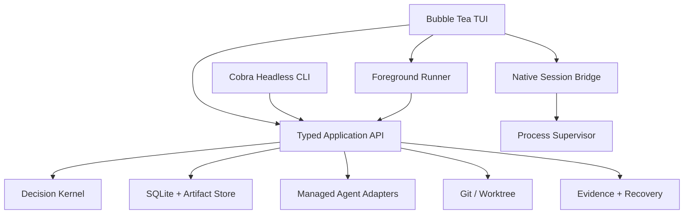

# CFlow TUI 主工作台与混合 Agent 交互设计

> 日期：2026-08-07<br>
> 状态：已由用户确认<br>
> 适用范围：CFlow 首个可用 TUI 主链路版本

## 1. 背景

CFlow 当前 Demo 已实现工作流状态、Agent Adapter、Git Worktree、DAG 调度、验证、审查、恢复、Apply 和审计证据等底层能力，但用户入口最终落成了行式 Cobra 子命令。直接执行 `cflow` 只显示命令树，用户必须手工串联 `workflow-create`、`discuss`、`plan-generate`、`execution-approve` 等命令；执行批准后也缺少面向用户的持续前台调度体验。

这与目标产品存在根本偏差。CFlow 应当首先是一个持续承载完整生命周期的全屏 TUI 工作台，而不是要求用户记忆状态机命令的 CLI 集合。同时，需求讨论阶段使用 Codex 或 Claude Code 的原生终端交互，效果优于 CFlow 自建的简化聊天框。

本设计将产品主入口调整为：

```text
CFlow 全屏 TUI（控制面）
  ├─ 项目与 Workflow 导航
  ├─ Plan / Spec / DAG / Diff / Approval
  ├─ 自动执行、状态、日志、证据与异常处理
  └─ 暂时切换到 Codex / Claude 原生 Terminal 完成需求讨论
```

底层 Runtime 仍然是状态与证据的唯一权威。TUI 不直接修改数据库、Git 或最终状态。

## 2. 目标

首版必须满足以下目标：

1. 用户在目标 Git 项目中只运行 `cflow`，即可从新建 Workflow 一直完成到显式 Apply。
2. CFlow 默认进入自适应生命周期工作台，而不是打印命令帮助。
3. 需求讨论默认进入 Codex 或 Claude Code 原生 Terminal；退出后恢复同一个 CFlow TUI。
4. 原生 Agent 直接在 CFlow 管理的完整 Workflow Worktree 中读写项目代码，不触碰用户原始工作目录。
5. 一个 Workflow 只有一条长期代码主线；并行任务仅使用临时 Task Worktree。
6. Plan、Spec、讨论、Session、Review、Evidence 和状态投影全部位于 Codebase 外部的聚合 Workflow 目录。
7. Execution Approval 后由前台 Runner 自动持续推进 DAG，不要求用户重复调用调度命令。
8. 普通 Task 成功自动推进；只有批准、阻塞、安全漂移、预算耗尽等需要用户决策的事件才打断用户。
9. 最终 Apply 必须更新原始 Working Tree 的 HEAD、Index 和文件内容，而不只是移动 Branch Ref。
10. 代码 Worktree 只能通过显式 Cleanup Dry Run 与确认删除，非生产 Artifact 和审计证据继续保留。
11. 现有 Headless CLI 继续作为脚本、诊断、自动化和无 TTY 环境的正式入口。

## 3. 非目标

首版不包含：

- 将 Provider 原生 TUI 嵌入 CFlow 中央面板；
- 后台 Daemon 或脱离当前终端继续运行；
- OpenCode Adapter；
- Web、Cloud 或 Remote Dashboard；
- 复杂插件系统或任意脚本 Workflow；
- 自动 Push、自动创建 PR 或跨仓库 Workflow；
- 成本分析平台、主题市场或鼠标优先的复杂交互；
- 以 TUI 替代确定性 Runtime、恢复协议或证据门禁。

## 4. 已确认的产品决策

| 决策 | 结论 |
|---|---|
| 主界面 | 自适应生命周期工作台 |
| Agent 交互 | 混合模式 |
| 原生 Terminal 默认阶段 | 需求讨论 |
| 阻塞处理 | 可对精确 Task/Session/Worktree 手动 Attach |
| 终端切换 | 挂起 CFlow Alternate Screen，在当前终端运行原生 Provider；退出后恢复 |
| 需求讨论写权限 | 允许在 Workflow Worktree 内直接修改代码 |
| 退出原生 Session 的含义 | 只把控制权交还 CFlow；用户再选择继续、Finish、切换 Agent 或暂停 |
| CLI | 保留为与 TUI 同级的 Headless 前端 |
| `cflow` 启动行为 | 打开项目工作台，默认选中最近活动 Workflow，但不自动恢复执行 |
| 执行打断策略 | 持续监控，只在需要用户决策时打断 |
| 首版范围 | 完整主链路 MVP |
| 目录布局 | 每个 Workflow 聚合代码 Worktree 与全部非生产产物 |
| 权威状态库 | 继续使用全局 `$CFLOW_HOME/cflow.db` |
| 长期代码主线 | 每个 Workflow 只有一个 `workspace/` |
| 并行执行 | 允许创建临时 Task Worktree，验收后合并回 `workspace/` |
| 清理 | 显式 Dry Run 与再次确认，不自动删除 |

## 5. 用户体验与信息架构

### 5.1 启动

在目标项目任意子目录运行：

```sh
cflow
```

有 TTY 时进入全屏工作台。没有 TTY 时返回稳定错误说明，并提示使用 `cflow list`、`cflow status`、`cflow inspect` 等 Headless 命令；不得隐式切换成会改变状态的批处理流程。

工作台启动后：

- 显示当前 Git Root、Target Branch、Provider 健康状态和 Git Policy 状态；
- 左侧列出当前 Project 的 Workflow；
- 默认选中最近活动 Workflow；
- 只读取状态，不自动 Resume、Dispatch、Apply 或 Cleanup；
- 没有 Workflow 时，中央区域展示新建入口和只读环境诊断。

### 5.2 固定布局

```text
┌─────────────────────────────────────────────────────────────────────┐
│ Project / Target Branch / Workflow / Provider & Git health          │
├────────────────┬───────────────────────────────┬────────────────────┤
│ Workflows      │ Stage-specific main view      │ Inspector          │
│ Lifecycle      │ Discussion / Plan / Specs     │ Status             │
│ Views          │ Approval / DAG / Report       │ Scope / Route      │
│                │ Diff / Cleanup                │ Budget / Evidence  │
├────────────────┴───────────────────────────────┴────────────────────┤
│ Legal actions / key hints / foreground process state                │
└─────────────────────────────────────────────────────────────────────┘
```

左侧包含：

- Workflow 列表；
- `Discuss → Plan → Define → Execute → Report → Apply → Cleanup` 生命周期；
- Overview、Artifacts、Events、Settings 等辅助视图。

中央区域按阶段切换：

- Discussion Return Page；
- Plan 与 Checker Evidence；
- Spec 列表与 Dynamic Workflow DAG；
- Plan Approval 与 Execution Approval；
- 实时 Task Graph、日志和选中 Task；
- Blocked Decision Panel；
- Final Report、Apply 和 Cleanup。

右侧 Inspector 始终解释当前选中对象：

- 状态与最近事件；
- Provider Route、Fallback 和 Session；
- Read/Write Scope、Verification Command；
- Retry/Cost Budget；
- Worktree、Branch、Base/Head；
- Artifact Revision、Hash 和 Evidence Reference。

终端宽度不足时，Inspector 折叠成独立详情页；核心操作不能依赖颜色或鼠标。

### 5.3 操作原则

- 切换页面、Workflow、Tab 或选中 Task 永远是只读动作。
- 有费用、修改状态或可能删除文件的动作必须进入明确的 Action/Confirmation 页面。
- Approval、Apply、Cancel 和 Cleanup 默认选择“否”。
- 快捷键只负责导航或打开动作，不让单个误触直接完成批准、交付或删除。
- TUI 展示的合法操作来自 Runtime View，不在界面层重新推断状态机。

## 6. 总体架构

采用两个前端共用一个权威 Runtime 的结构：



### 6.1 新模块

#### `internal/tui`

负责：

- Bubble Tea Model、Update、View；
- 页面、组件、Focus、Keymap、响应式布局；
- 将 Application View 映射为 UI ViewModel；
- 订阅已提交事件并刷新投影；
- 发起用户明确选择的类型化 Command。

禁止：

- 直接读取或写入 SQLite；
- 直接调用 Git 或 Provider；
- 根据 Agent 文本决定成功；
- 自行推进 Workflow 状态。

首版采用 `charm.land/bubbletea/v2` 的稳定 v2 API。设计基于其 Alternate Screen、声明式 View 与暂停交互程序后恢复的能力；依赖必须在实施计划中以固定版本提交，不使用浮动 `latest`。参考 [Bubble Tea 官方仓库](https://github.com/charmbracelet/bubbletea) 与 [交互子进程执行接口](https://pkg.go.dev/github.com/charmbracelet/bubbletea#ExecProcess)。

#### `internal/foreground`

提供一个可被 TUI 与 `cflow run` 复用的 Foreground Runner：

- 每次执行一个有界的 `DriveOnce`；
- 在每次迭代前读取权威 Projection；
- 只请求 Application 执行当前合法的恢复、调度、收敛或完成动作；
- 将已经提交的 Outcome 发布为类型化事件；
- 在 Completed、Paused、Blocked、Cancelled 或无进展安全状态停止；
- 绝不直接写状态，也不绕过 Decision Kernel。

`DriveOnce` 是深模块边界：它封装 Recovery、Dispatch、Reconcile 和 Completion 的单次安全推进，返回：

```text
Progressed
WaitingForRunningProcess
NeedsUser
Terminal
NoSafeProgress
```

`NoSafeProgress` 不能形成无限空转；Runtime 记录结构化 Finding 并进入可诊断状态。

#### `internal/native`

Native Session Bridge 负责：

- 让 Provider Adapter 建立并固定精确 Session ID；
- 通过 Process Supervisor 运行原生交互进程；
- 暂停和恢复 TUI 的终端模式；
- 记录脱敏 argv、cwd、Provider Binding 和进程结果；
- 退出后触发 Git、Session、Process 与 Artifact Reconcile。

TUI 只提供终端流和用户意图，不直接构造 `exec.Cmd`。Native Bridge 使用符合 Bubble Tea 交互执行接口的受管命令适配器，所有进程仍属于 Process Supervisor。

### 6.2 现有模块继续保留

以下底层能力保留并作为权威实现：

- `internal/model` 与 `internal/decision`；
- `internal/store` 与 Migration；
- `internal/artifact`；
- `internal/agent` 及 Codex/Claude 托管 Adapter；
- `internal/gitflow`；
- `internal/process`；
- `internal/recovery`；
- Verification、Review、Merge、Apply 和 Cleanup Gate。

现有过大的 CLI/Application 文件需要按 TUI 所需的类型化边界做定向拆分，但不重写领域模型。

## 7. 聚合目录与状态权威

默认 `CFLOW_HOME` 为 `~/.cflow`。用户写出的 `/.cflow` 不作为默认路径，因为系统根目录不符合普通用户权限与可移植性要求。

```text
~/.cflow/
├── cflow.db                         # 全局权威状态
├── locks/
├── schemas/
└── projects/
    └── <project-key>/
        └── <workflow-id>/
            ├── workspace/           # 唯一长期代码主线，完整 Git Worktree
            ├── discussion/          # 结构化 Handoff 与回合元数据
            ├── plans/
            ├── specs/
            ├── workflows/           # Dynamic Workflow / DAG
            ├── reviews/
            ├── sessions/
            ├── evidence/
            ├── logs/
            ├── reports/
            ├── state/               # Manifest、状态投影、恢复辅助信息
            └── tmp/
                ├── tasks/<task-id>/ # 并行临时 Task Worktree
                └── apply-<n>/       # Apply 暂存 Worktree
```

规则：

1. `cflow.db` 继续是 Workflow、Event、Approval、Attempt、Finding 和路径绑定的权威状态源。
2. `state/` 中的文件是可重建投影、Manifest 与恢复辅助证据，不与 SQLite 形成双权威。
3. Plan、Spec、讨论、Session、Review、Evidence 和 Report 不写入目标 Codebase。
4. `workspace/` 与 `tmp/**` 是完整 Git Worktree；Artifact 目录不是 Agent 的代码 cwd。
5. 敏感目录、文件、Owner、Mode、Symlink 和 Canonical Path 继续遵循现有安全门禁。

## 8. 单主线 Workflow Worktree

### 8.1 创建

创建 Workflow 时立即：

1. 固定 Target Repository、Target Branch 和 Base Commit；
2. 在 SQLite 写入 Workflow 创建 Intent；
3. 创建：

   ```text
   ~/.cflow/projects/<project-key>/<workflow-id>/workspace
   ```

4. 从 Base Commit 创建 `cflow/<workflow-id>/workspace` Branch；
5. 通过 `git worktree list --porcelain -z`、路径、Branch 和 HEAD 验证结果；
6. 写入 Result 后才允许启动 Provider。

该 Worktree 是 Workflow 从讨论到最终验收的唯一长期代码主线。

### 8.2 候选 Head 与已验收 Head

原生讨论允许 Agent 修改文件，也可能创建 Commit。为避免把讨论阶段 Commit 误称为已验收结果，Runtime 分别记录：

- `candidate_workspace_head`：Workspace 当前实际 HEAD；
- `verified_workspace_head`：已经通过适用 Commit、Clean、Scope、Verification 和 Review Gate 的最后 Head；
- `workspace_dirty_fingerprint`：Index、Tracked、Untracked 和进行中 Git 操作的精确事实。

任何自动 Task 只能从 `verified_workspace_head` 创建。未通过 Adoption Gate 的候选 Commit 不得作为后续 Task 基线。

### 8.3 冻结 Change Set

用户在 Discussion Return Page 选择 Finish 时，CFlow 冻结不可变 Change Set Revision，至少包含：

- Base Commit；
- Workspace Branch 与 candidate/verified Head；
- Base 到 Candidate 的 Commit Range；
- Staged、Unstaged、删除、重命名和二进制 Diff；
- Untracked Path、Mode、Size、Content Hash 与受保护内容；
- Dirty Fingerprint 和 Git In-progress 状态；
- Provider、Session、Binding 与退出结果；
- Change Set 总 Hash。

Change Set 保存完整可验证内容，不只保存自然语言摘要。继续讨论后再次 Finish 会创建新 Revision，不覆盖旧 Revision。

### 8.4 Adoption Gate

Execution Approval 必须绑定最终 Change Set Revision 与 Hash。批准后，Runner 先执行 Workspace Adoption Gate：

1. 重验 Workspace 的 Branch、candidate/verified Head、Dirty Fingerprint 与 Change Set；
2. 对尚未提交的修改运行受管 Adoption/Coding Session，使其在 Workspace 中整理并提交；
3. 检查所有候选 Commit 的 Identity、Signing、Scope、Append-only 和 Evidence；
4. 执行固定 Verification Catalog；
5. 启动独立 Review Session；
6. 全部通过后把 `verified_workspace_head` 推进到精确 Candidate Head；
7. 失败时保留 Workspace 和 Change Set，Workflow Blocked，不回写 Target Branch。

Native Session 中提前创建的 Commit 可以成为候选事实，但直到 Adoption Gate 通过前都不是已验收历史。

### 8.5 并行临时 Task Worktree

需要并行时：

```text
<workflow-id>/tmp/tasks/<task-id>/
```

- 每个 Task 从当时固定的 `verified_workspace_head` 创建独立 Branch/Worktree；
- Agent 只在自己的 Task Worktree 中执行；
- Task 必须通过 Commit、Clean、Scope、Verification 和独立 Review；
- Task 通过后，Scheduler 以“当前 Workspace 已验收 Head + 精确 Task Head”创建不可变 Merge Intent；合并启动前对这两个 Head 执行 Compare-and-Swap 检查；
- 并行兄弟 Task 的 Commit 可以基于同一个旧 Head，但它们的 Merge 必须串行。每次 Merge 都以当时最新的已验收 Workspace Head 创建新 Intent，通过受限 Merge/Conflict Gate 后再推进 Workspace；不得为追上兄弟 Merge 而自动 Rebase 或重写 Task 历史；
- 合并成功后只推进同一个 Workspace Branch；
- 失败或冲突保留 Task Worktree 和证据，等待 Runtime 决策；
- Worktree 不自动删除，进入显式 Cleanup Manifest。

因此用户只感知一个长期 `workspace/`，临时 Task Worktree 只是并行隔离机制，不形成第二条长期主线。

## 9. 原生需求讨论协议

### 9.1 建立 Session

原生讨论必须绑定精确 Session，而不是启动一个无法恢复的匿名终端：

1. Provider Registry 重验 Codex/Claude 的 Native Interactive Resume Capability；
2. CFlow 在 Workflow Worktree 中执行最小托管 Bootstrap，建立并捕获 Session ID；
3. Bootstrap 只建立上下文与 Session，不代表讨论完成；
4. CFlow 持久化 Provider、Version、Executable Identity、Session ID 和 Workspace Binding；
5. TUI 退出 Alternate Screen，把 stdin/stdout/stderr 交给该 Session 的原生 Resume 命令。

Provider 不支持精确原生 Resume、Session ID 冲突或 Binding 漂移时 fail closed，不启动模糊 Session。

### 9.2 原生交互

- 原生进程 cwd 是 Workflow Worktree；
- 允许读取、修改和创建 Workspace 内文件；
- 使用 Provider 自身完整交互体验与用户现有配置；
- CFlow 不拦截 Provider 内部快捷键或 `/finish`；
- CFlow 不解析或持久化屏幕画面；
- CFlow 不是 OS Sandbox，不承诺 Agent 无法访问 Worktree 外部资源；
- Process Supervisor 仍记录进程身份、脱敏启动事实并执行有界停止。

### 9.3 返回 CFlow

原生进程退出只表示控制权交还 CFlow。TUI 恢复后必须：

1. 观察进程退出事实；
2. 重验 Provider Session 与 Binding；
3. 重验 Workspace Branch、HEAD、Status、Dirty Fingerprint 和 Git In-progress 状态；
4. 显示本轮 Workspace Diff 与 Session 摘要；
5. 提供以下明确动作：
   - 继续同一 Session；
   - 完成讨论并生成 Plan；
   - 切换 Agent；
   - 暂停；
   - 取消 Workflow。

非零退出不会自动等价为讨论失败。用户可以重进同一 Session、切换 Agent 或暂停。

### 9.4 Finish 与结构化 Handoff

用户选择“完成讨论并生成 Plan”后：

1. 冻结 Change Set Revision；
2. 通过同一 Provider Session 的托管结构化 Resume 生成 Discussion Handoff；
3. Handoff 包含目标、约束、非目标、验收标准、未决项、Workspace Change Set 引用和用户决策；
4. 托管 Resume 前后重验 Workspace；若 Plan 生成意外改变代码，则拒绝本轮 Plan 输出并要求重新协调；
5. Plan Generation 使用不可变 Handoff 与 Change Set，而不是解析终端画面。

切换 Provider 时创建新的 Session，并注入版本化 Context Bundle；旧 Session 与切换原因继续保留。

## 10. 主生命周期

```mermaid
flowchart LR
    A[Project Workspace] --> B[Create Workflow + Workspace]
    B --> C[Native Discussion + Coding]
    C --> D[Freeze Change Set + Handoff]
    D --> E[Plan Generation + Independent Check]
    E --> F{Plan Approval}
    F -->|Revise| C
    F -->|Approve| G[Specs + Catalog + Dynamic Workflow + Preflight]
    G --> H{Execution Approval}
    H -->|Adjust| G
    H -->|Approve| I[Workspace Adoption Gate]
    I --> J[Foreground Runner + Task DAG]
    J --> K[Final Verification + Report]
    K --> L[Protected Apply]
    L --> M[Explicit Cleanup]
```



主链路仍只有两个常规批准门：

1. Plan Approval；
2. Execution Approval。

Change Set、Spec、Catalog、Dynamic Workflow、Route、Budget 和 Git Policy 都在 Execution Approval 中集中检查。普通 Task、Retry、Verification、Review 和 Merge 在已批准边界内自动运行。

## 11. Foreground Runner

### 11.1 生命周期

Runner 只在用户明确选择 Resume/Run 后启动。打开 TUI 或选中 Workflow不会启动 Runner。

循环：

```text
Read authoritative projection
  → Recovery/Reconcile before mutation
  → DriveOnce
  → persist Outcome
  → publish typed UI event
  → refresh projection
  → repeat or stop
```

### 11.2 停止条件

Runner 在以下状态停止并把控制权交给 TUI：

- Plan Approval；
- Execution Approval；
- Commit Policy/Replacement/Apply Confirmation；
- Paused；
- Blocked；
- Cancelled；
- Completed；
- Budget Exhausted；
- Provider Authentication/Protocol/Binding 问题；
- No Safe Progress。

### 11.3 事件模型

UI Event Stream 是已经提交 Outcome 的通知，不是权威状态库。TUI 丢失事件、重绘或重连后必须重新 Query Projection，不能依赖内存消息恢复状态。

## 12. 暂停、Attach、退出与恢复

### 12.1 Ctrl+C 与退出

- 第一次 Ctrl+C 请求受控暂停：关闭 Dispatch Gate，不启动新动作，等待或有界停止受管进程，保存 Checkpoint；
- 第二次 Ctrl+C 才执行强制终止；
- TUI 中存在活动 Run 时，普通退出必须先展示 `Pause and Exit`；
- 首版不允许 Runner 作为失联后台 Job 继续运行。

### 12.2 Blocked Attach

Attach 必须绑定精确：

- Workflow；
- Task/Attempt；
- Provider/Session；
- Task Worktree 或 Workflow Worktree；
- Base/Start Head 与 Dirty Fingerprint。

Attach 返回后，Runtime 重验 Session、HEAD、Dirty、Commit、Scope、Verification 和 Review 事实。原生 Agent 不能直接写入 Task Success 或 Workflow Completion。

### 12.3 Crash Recovery

重启后先根据以下事实恢复：

- SQLite Intent/Result/Event；
- Git Worktree Registry；
- Branch、Refs、Audit Refs 与 Commit；
- Workspace/Task/Apply 目录和 Fingerprint；
- Process Identity 与存活状态；
- Artifact、Session 和 Evidence。

Recovery 未收敛前不得重新打开 Dispatch Gate或启动 Provider。TUI 只展示恢复结果与合法动作。

## 13. Apply 与原始代码目录

### 13.1 Apply Staging

Workflow 完成后，原始 Target Branch 仍不改变。用户选择 Apply 时：

1. 重验原始 Working Tree 干净且仍位于记录的 Target Branch；
2. 固定当前 Target HEAD 与已验收 Workspace Head；
3. 在 `<workflow-id>/tmp/apply-<n>/` 创建独立 Apply Worktree；
4. 合并 Workspace 结果；
5. 执行 Apply Verification Catalog；
6. 运行独立 Apply Review；
7. 展示精确 Diff、Commit、Evidence 和目标分支。

普通 Apply 只准备和复验，不修改原始代码目录。

### 13.2 显式交付

用户再次明确确认后：

1. 在 Project Writer Lock 下重新检查原始 Working Tree、Target Branch 和 Expected Target Head；
2. 重验 Reviewed Apply Head、Workspace Head、Commit Policy 和 Evidence Subject；
3. 在原始 Git Root 执行 workspace-aware `git merge --ff-only <reviewed-apply-head>`；
4. 禁止 Force、Reset、Checkout、Stash 或自动覆盖；
5. 命令后验证原始 Working Tree 的 HEAD 等于 Reviewed Apply Head，Index/工作目录干净且文件内容与 HEAD 一致；
6. 任一前后事实不符则 Block Apply，不把未知状态报告为成功。

这将修正当前实现仅通过 `git update-ref` 移动 Target Ref、不能充分保证原始工作目录文件与 Index 同步的问题。

## 14. 显式 Cleanup

Apply 成功后，TUI 提示用户进入 Cleanup，但不自动删除代码。

第一次操作只生成不可变 Dry Run Manifest，包含：

- 精确 Canonical Path；
- Worktree 类型；
- Workflow、Branch、HEAD；
- Git Worktree Registry 事实；
- Dirty/In-progress Fingerprint；
- 活动进程与 Lock；
- 可删除原因；
- Manifest Hash。

用户再次确认精确 Manifest 后，Cleanup 只删除：

- `<workflow-id>/workspace/`；
- `<workflow-id>/tmp/tasks/*`；
- `<workflow-id>/tmp/apply-*`；
- 明确登记为 Scratch 的临时 HOME/Cache。

Cleanup 不删除：

- Discussion、Plan、Spec、Dynamic Workflow；
- Session、Review、Evidence、Log、Report；
- SQLite Event/Approval/Attempt/Finding；
- Commit、Branch 或 Audit Ref。

删除必须使用安全的 Git Worktree Remove 与精确路径校验，不使用 `--force`、全局 Prune、通配符、TTL 或后台 GC。任一项不干净或事实漂移时 Block，不扩大删除集合。

## 15. 旧目录迁移

当前实现把 Artifact 与 Worktree 分开：

```text
~/.cflow/projects/<project-key>/workflows/<workflow-id>/
~/.cflow/worktrees/<project-key>/<workflow-id>/
```

新布局改为：

```text
~/.cflow/projects/<project-key>/<workflow-id>/
```

迁移策略：

1. 新 Workflow 立即使用新布局；
2. 只读命令和 TUI 浏览可以识别旧布局，但绝不自动移动；
3. 旧 Workflow 标记为 `Legacy Layout`；需要继续执行、Apply 或 Cleanup 前，用户显式选择迁移；
4. TUI 先展示源路径、目标路径、Git Worktree、Artifact、数据库行和预计影响；
5. 创建并验证 SQLite 一致性备份；
6. 获取 DB Schema/Project Writer/Workflow Owner 等适用排他锁；
7. 写入不可变 Layout Migration Intent 与 Manifest；
8. Git Worktree 使用类型化 `git worktree move` 或等价受管操作；Artifact 在安全路径边界内移动；
9. 外部事实全部验证后，在数据库事务中更新路径绑定并写入 Result；
10. Crash Recovery 根据 Intent、源/目标目录、Git Registry 和 DB事实继续、识别完成或 Block，不猜测、不覆盖；
11. 不提供 Down Migration 或自动删除旧数据。

Layout Migration 与数据库 Schema Migration 是两个独立协议，不能在一个 SQLite DDL/DML 事务中偷偷执行 Git 或文件系统迁移。

## 16. 错误处理

TUI 对 Fault 的展示必须包含：

- 稳定 Code 与范围；
- 人类可读摘要；
- 证据引用；
- 受影响的 Workflow/Task/Session/Worktree；
- 是否消耗 Retry/Budget；
- Runtime 判定的合法操作。

典型行为：

| 场景 | 行为 |
|---|---|
| 原生 Provider 非零退出 | 返回 Discussion Return Page；允许继续同一 Session、切换或暂停 |
| Provider Binding/Auth 失败 | 不启动 Session；展示 Doctor 事实 |
| Approval 输入漂移 | 保持暂停，重建完整预览 |
| Workspace/Task Scope 或 Commit Gate 失败 | Block，保留 Worktree 与 Evidence |
| 一个并行 Task 不可重试失败 | 关闭 Dispatch Gate，只允许已运行 Attempt 有界收敛 |
| Renderer 失败 | 不改变 Runtime；用户可使用 Headless CLI 恢复 |
| Layout Migration 中断 | 根据 Intent/外部事实恢复或 Block |
| Apply Target 漂移 | Block Apply，原始 Target Branch 不变 |
| Cleanup 事实漂移 | 不删除当前及后续未处理项 |

不得提供 Force、Ignore、Best-effort 或把 Agent 自然语言声明当成成功的入口。

## 17. 测试与验收

### 17.1 TUI Unit Tests

- Model/Update/View 纯状态测试；
- Workflow、Lifecycle、Focus 与 Keymap 导航；
- 默认否确认页；
- Terminal Resize 与窄屏折叠；
- ViewModel 对 Fault、Approval、Task 和 Evidence 的完整映射；
- 常见终端尺寸的 Golden Snapshot。

### 17.2 Native Session Component Tests

- Fake Interactive Command 验证 Alternate Screen suspend/restore；
- stdin/stdout/stderr 归属；
- 精确 Session ID 与 Resume；
- 非零退出、Ctrl+C、超时和 Process Identity；
- 返回后的 Workspace/Session Reconcile；
- Finish 结构化 Handoff 与意外代码变化拒绝。

### 17.3 Runner Tests

使用 Fake Agent 和确定性 Store 驱动：

- Approval 后自动推进到 Completed；
- 并行 Task 分配与 Workspace CAS Merge；
- Paused/Blocked/Cancelled 停止；
- Retry Budget；
- No Safe Progress；
- Ctrl+C 两阶段停止；
- Crash 后不重复 Dispatch 或 Commit。

### 17.4 Git 与存储 Integration Tests

真实临时 Git 仓库覆盖：

- 聚合目录创建；
- Workspace candidate/verified Head；
- Change Set 冻结；
- 临时 Task Worktree 与合并；
- Layout Migration 的完成和 Crash 窗口；
- Workspace-aware Apply 对 HEAD、Index 和文件的更新；
- Apply Drift；
- Cleanup Dry Run、确认、部分失败与恢复。

### 17.5 E2E Gate

默认 Gate 使用 Fake Provider，覆盖从 `cflow` 启动到 Apply/Cleanup 的完整键盘流程。真实 Codex/Claude Native + Headless E2E 需要单独授权，因为会调用 Provider、可能产生费用并修改 CFlow 管理的 Worktree。真实 Gate 必须记录：

- CFlow Binary Hash 与 Source Commit；
- Provider Version/Binding；
- Session ID；
- Workspace/Task/Apply Commit；
- Approval 与 Evidence Hash；
- 原始 Target Branch Apply 结果；
- Cleanup Manifest 与结果。

## 18. 成功标准

只有同时满足以下条件，TUI MVP 才可以称为完成：

1. 新用户无需记忆生命周期子命令即可从创建 Workflow 到显式 Apply。
2. 原生 Codex/Claude 需求讨论可以直接修改 Workflow Worktree，并在返回后可靠恢复同一 Session。
3. Plan/Spec/Discussion/Review/Evidence 不进入目标 Codebase。
4. Execution Approval 后 Runner 自动持续推进，不需要手工重复 Dispatch。
5. 用户只感知一个长期 Workspace 主线；并行临时 Worktree 不形成第二条长期历史。
6. 打开/退出 TUI、页面导航和 Renderer 故障不会隐式改变 Runtime。
7. Crash、Provider Failure、Migration Interruption 和 Apply Drift 均可恢复或稳定 Block，不修改未知状态。
8. 成功 Apply 后原始 Working Tree 的 HEAD、Index 和文件内容一致。
9. 显式 Cleanup 能安全释放代码 Worktree 空间，同时保留全部非生产 Artifact、Evidence 和 Git 审计历史。
10. Headless CLI 继续可用于诊断、脚本和无 TTY 环境。

## 19. 对当前文档与实现的影响

本设计获批后，实施前必须同步修订：

- `docs/cflow-prd.md` 中“Demo 不使用全屏 TUI”的已确认决策；
- `docs/cflow-demo-design.md` 的 line-oriented CLI 架构；
- `docs/cflow-demo-implementation-plan.md` 中“No full-screen TUI”、旧目录和交互任务；
- `AGENTS.md` 中“不实现完整 TUI”的当前阶段约束；
- README 的当前用法、状态与非目标；
- Gate 3 验收范围与历史证据主体。

现有 Gate 3 证据只证明旧的行式 Demo，不证明本设计。TUI、Native Session、聚合目录、Runner、Workspace-aware Apply 与显式 Cleanup 全部通过新的 Gate 后，才能形成新的候选证据。

本设计不授权直接实施。下一步是在用户复核本文后，单独编写按小提交、独立 Review 和 Gate 排序的实施计划。
